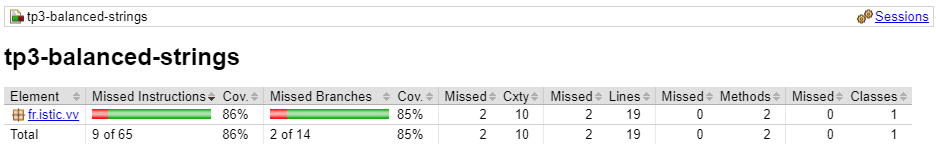
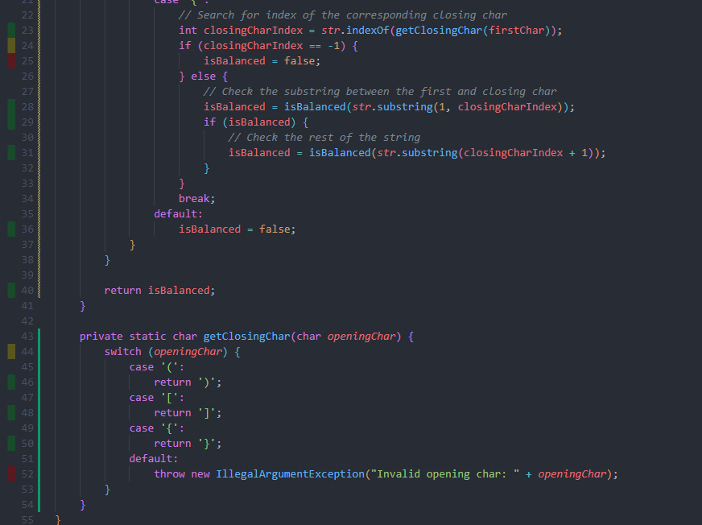
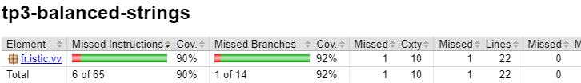
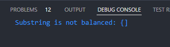
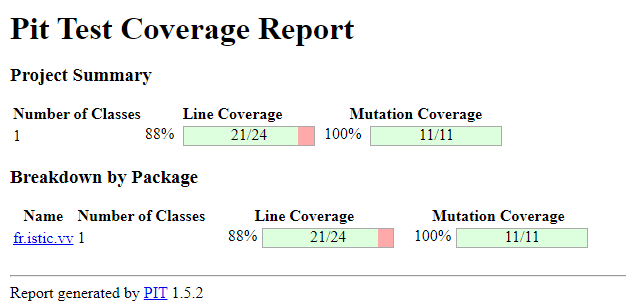

# Balanced strings

A string containing grouping symbols `{}[]()` is said to be balanced if every open symbol `{[(` has a matching closed symbol `)]}` and the substrings before, after and between each pair of symbols is also balanced. The empty string is considered as balanced.

For example: `{[][]}({})` is balanced, while `][`, `([)]`, `{`, `{(}{}` are not.

Implement the following method:

```java
public static boolean isBalanced(String str) {
    ...
}
```

`isBalanced` returns `true` if `str` is balanced according to the rules explained above. Otherwise, it returns `false`.

Use the coverage criteria studied in classes as follows:

1. Use input space partitioning to design an initial set of inputs. Explain below the characteristics and partition blocks you identified.
2. Evaluate the statement coverage of the test cases designed in the previous step. If needed, add new test cases to increase the coverage. Describe below what you did in this step.
3. If you have in your code any predicate that uses more than two boolean operators, check if the test cases written so far satisfy *Base Choice Coverage*. If needed, add new test cases. Describe below how you evaluated the logic coverage and the new test cases you added.
4. Use PIT to evaluate the test suite you have so far. Describe below the mutation score and the live mutants. Add new test cases or refactor the existing ones to achieve a high mutation score.

Write below the actions you took on each step and the results you obtained.
Use the project in [tp3-balanced-strings](../code/tp3-balanced-strings) to complete this exercise.

## Answer

1. The different cases of inputs I identified are:
    - An empty string
    - An unbalanced string with only one open or close character
    - A balanced string with one open and one close symbol
    - An unbalanced string with one close and one open symbol
    - A balanced string with multiple open and close symbols
    - An unbalanced string with multiple open and close symbols
    - A balanced string with multiple nested open and close symbols
    - An unbalanced string with multiple nested open and close symbols

2. To test the statement coverage I installed Jacoco using the instructions of [this SO answer](https://stackoverflow.com/a/77464184). I then ran the tests and checked the coverage report. The result is the following :



We can see that the coverage is 86% because 2 lines were missed. Using the `Coverage Gutters` extension on VSCode, I easily identified the line that weren't covered.



I then added a new test to make sure the line 25 is tested :

```java
@Test
void testOpenCharWithoutClosingCharIsNotBalanced() {
    assertFalse(isBalanced("({}]"));
}
```

Line 51 and 52 are theoretically unreachable code but I keep them to make sure the privat method `getClosingChar` isn't used wrongly. However this means I cannot find a test case that will cover them.

Statement coverage is now at 90% with 1 line missed.



3. To evaluate the logic coverage I identified all the predicates in the code. There are 3 of them :

- Line 11 : `if (str.isEmpty())`
- Line 13 : `if (str.length() % 2 != 0)`
- Line 24 : `if (closingCharIndex == -1)`
- Line 29 : `if (isBalanced)`

The first 3 have `else` statements, and those statement are covered as shown in the coverage report. This means those 3 predicate are evaluated to both `true` and `false` in my existing tests. 

For the 4th one however it is not clear if it is ever evaluated to `false`. I added a test case to make sure it is covered :

```java
@Test
void testSubstringIsNotBalanced() {
    assertFalse(isBalanced("({])"));
}
```

To make sure the condition is evaluated to `false` I added a temporary print statement in the method :

```diff
if (isBalanced) {
    // Check the rest of the string
    isBalanced = isBalanced(str.substring(closingCharIndex + 1));
-}
+} else {
+    System.out.println("Substring is not balanced: " + str.substring(1, closingCharIndex));
+}
```



4. I ran PIT on the project and got the following results :



The mutation score is 100% and there are 0 live mutants. This means the test suite is good enough to catch all the bugs in the code.

PIT counts 4 lines as not covered. This is because it counts the unused empty constructor as well as line 51 and 52.