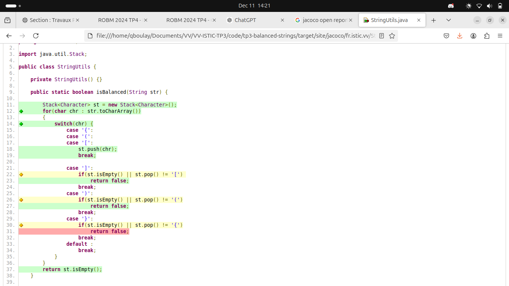
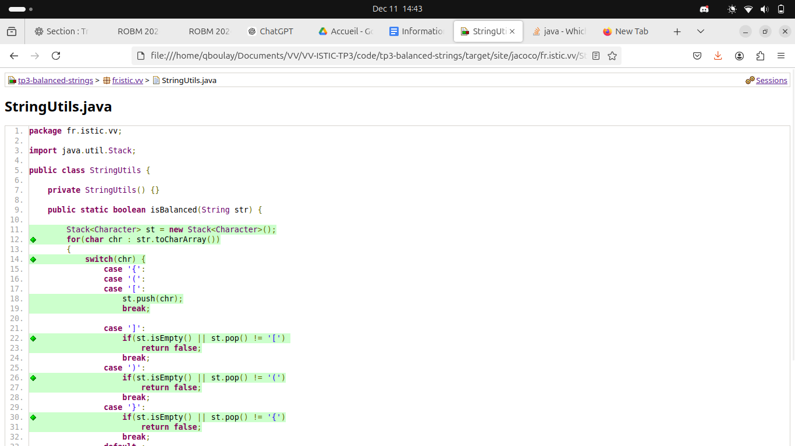
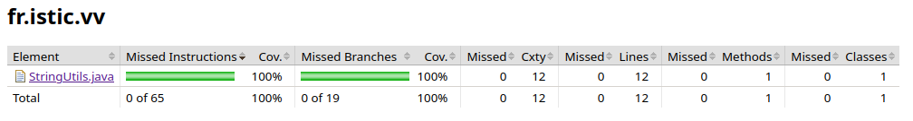

# Balanced strings

A string containing grouping symbols `{}[]()` is said to be balanced if every open symbol `{[(` has a matching closed symbol `)]}` and the substrings before, after and between each pair of symbols is also balanced. The empty string is considered as balanced.

For example: `{[][]}({})` is balanced, while `][`, `([)]`, `{`, `{(}{}` are not.

Implement the following method:

```java
public static boolean isBalanced(String str) {
    ...
}
```

`isBalanced` returns `true` if `str` is balanced according to the rules explained above. Otherwise, it returns `false`.

Use the coverage criteria studied in classes as follows:

1. Use input space partitioning to design an initial set of inputs. Explain below the characteristics and partition blocks you identified.
2. Evaluate the statement coverage of the test cases designed in the previous step. If needed, add new test cases to increase the coverage. Describe below what you did in this step.
3. If you have in your code any predicate that uses more than two boolean operators, check if the test cases written so far satisfy *Base Choice Coverage*. If needed, add new test cases. Describe below how you evaluated the logic coverage and the new test cases you added.
4. Use PIT to evaluate the test suite you have so far. Describe below the mutation score and the live mutants. Add new test cases or refactor the existing ones to achieve a high mutation score.

Write below the actions you took on each step an    d the results you obtained.
Use the project in [tp3-balanced-strings](../code/tp3-balanced-strings) to complete this exercise.

## Answer

Le fichier de [code](../code/tp3-balanced-strings/src/main/java/fr/istic/vv/StringUtils.java).
Le fichier de [test](../code/tp3-balanced-strings/src/test/java/fr/istic/vv/StringUtilsTest.java).

1 - Partitionnement

| Charactéristique                 | Block                          |                            |
|----------------------------------|--------------------------------|----------------------------|
| Présence de characteres spécials | Avec charactere <br>([a{}b]c)  | Sans <br> abc              |
| Nombre de (  )                   | Autant de ( que de ) <br> (()) | Pas le même nombre <br>(() |
| Ordonnonencement de la séquence  | Bien ordonnée <br>({})         | Mal ordonnée <br>({)}      |
| Ordre des ouvertures/fermetures  | Bien ordonnés <br> ({[]})[]    | Mal ordonnée <br> ])(}{ [  |

C'est difficile de faire du partitionnement sur cette fonction car l'étendu des possiblitées pour un string et en particulier sur cette fonction est dûre à mettre en place. Je trouve difficile d'identifier des charachtéristic intéressantes sans pour autant rentrer dasn des cas trés précis.

Les tests se lancent et sont corrects.

2 - Voici le coverage juste après la question 1 :



Il manque visiblement des cas de test pour l'accolade fermante et certaines conditions sont partiellement testées.

Je rajoute des tests.




Après ajouts des test la couverture de code est de 100%. 

3- Après vérification chaque cas pour les conditions sont bien étudiées. Le base choice coverage est satisfait.

4- Lancement de Pit sur le projet :

```bash 
================================================================================
- Mutators
================================================================================
> org.pitest.mutationtest.engine.gregor.mutators.BooleanTrueReturnValsMutator
>> Generated 4 Killed 4 (100%)
> KILLED 4 SURVIVED 0 TIMED_OUT 0 NON_VIABLE 0 
> MEMORY_ERROR 0 NOT_STARTED 0 STARTED 0 RUN_ERROR 0 
> NO_COVERAGE 0 
--------------------------------------------------------------------------------
> org.pitest.mutationtest.engine.gregor.mutators.BooleanFalseReturnValsMutator
>> Generated 1 Killed 1 (100%)
> KILLED 1 SURVIVED 0 TIMED_OUT 0 NON_VIABLE 0 
> MEMORY_ERROR 0 NOT_STARTED 0 STARTED 0 RUN_ERROR 0 
> NO_COVERAGE 0 
--------------------------------------------------------------------------------
> org.pitest.mutationtest.engine.gregor.mutators.NegateConditionalsMutator
>> Generated 6 Killed 6 (100%)
> KILLED 6 SURVIVED 0 TIMED_OUT 0 NON_VIABLE 0 
> MEMORY_ERROR 0 NOT_STARTED 0 STARTED 0 RUN_ERROR 0 
> NO_COVERAGE 0 
--------------------------------------------------------------------------------
================================================================================
- Timings
================================================================================
> scan classpath : < 1 second
> coverage and dependency analysis : < 1 second
> build mutation tests : < 1 second
> run mutation analysis : < 1 second
--------------------------------------------------------------------------------
> Total  : 1 seconds
--------------------------------------------------------------------------------
================================================================================
- Statistics
================================================================================
>> Generated 11 mutations Killed 11 (100%)
>> Ran 17 tests (1.55 tests per mutation)
[INFO] ------------------------------------------------------------------------
[INFO] BUILD SUCCESS
[INFO] ------------------------------------------------------------------------
[INFO] Total time:  10.400 s
[INFO] Finished at: 2024-12-11T15:33:30+01:00
[INFO] ------------------------------------------------------------------------
```

Aucun mutant n'a survécu et le score de mutation est 100%. La classe est bien testée.
