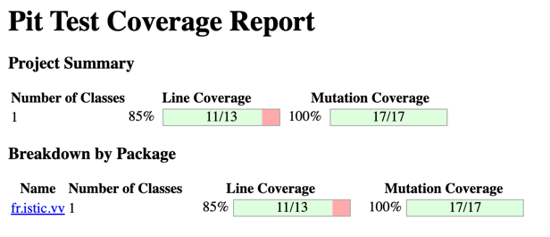

# Balanced strings

A string containing grouping symbols `{}[]()` is said to be balanced if every open symbol `{[(` has a matching closed symbol `)]}` and the substrings before, after and between each pair of symbols is also balanced. The empty string is considered as balanced.

For example: `{[][]}({})` is balanced, while `][`, `([)]`, `{`, `{(}{}` are not.

Implement the following method:

```java
public static boolean isBalanced(String str) {
    ...
}
```

`isBalanced` returns `true` if `str` is balanced according to the rules explained above. Otherwise, it returns `false`.

Use the coverage criteria studied in classes as follows:

1. Use input space partitioning to design an initial set of inputs. Explain below the characteristics and partition blocks you identified.
2. Evaluate the statement coverage of the test cases designed in the previous step. If needed, add new test cases to increase the coverage. Describe below what you did in this step.
3. If you have in your code any predicate that uses more than two boolean operators, check if the test cases written so far satisfy *Base Choice Coverage*. If needed, add new test cases. Describe below how you evaluated the logic coverage and the new test cases you added.
4. Use PIT to evaluate the test suite you have so far. Describe below the mutation score and the live mutants. Add new test cases or refactor the existing ones to achieve a high mutation score.

Write below the actions you took on each step and the results you obtained.
Use the project in [tp3-balanced-strings](../code/tp3-balanced-strings) to complete this exercise.

## Answer

1. Cas à tester :
- "" (Chaîne vide)
- {[]} (Valide)
- () (Valide)
- ({}) (Valide)
- }( (Invalide - parenthèse fermante en trop)
- [({})] (Valide)
- {( (Invalide - parenthèse ouvrante sans fermante)
- ([)] (Invalide - imbriquées)
- { (Invalide - uniquement une parenthèse ouvrante)
- }} (Invalide - uniquement des parenthèses fermantes)
- {He(l)lo} (Valide) avec du texte

2. Les tests ont l'air assez complets et couvrent une grande partie du code. En effet, si on reprend chaque cas à la main, on passe dans toutes les conditionnelles en testant à chaque fois toutes les valeurs qu'elles peuvent prendre.

3. Pour améliorer nos tests, nous avons ajouté des tests matérialisant chacunes des possibilités offertes par la conditionnelle comme commencer une chaîne de caractère par une accolade fermante.

4. </img>

On observe que tous les mutants sont bien tués à l'exécution, il n'y a donc pas besoin d'ajouter de tests.