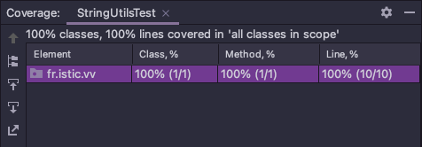
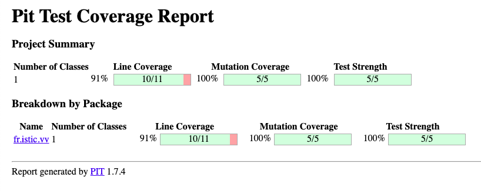

# Balanced strings

A string containing grouping symbols `{}[]()` is said to be balanced if every open symbol `{[(` has a matching closed symbol `]}` and the substrings before, after and between each pair of symbols is also balanced. The empty string is considered as balanced.

For example: `{[][]}({})` is balanced, while `][`, `([)]`, `{`, `{(}{}` are not.

Implement the following method:

```java
public static boolean isBalanced(String str) {
    ...
}
```

`isBalanced` returns `true` if `str` is balanced according to the rules explained above. Otherwise, it returns `false`.

Use the coverage criteria studied in classes as follows:

1. Use input space partitioning to design an initial set of inputs. Explain below the characteristics and partition blocks you identified.
2. Evaluate the statement coverage of the test cases designed in the previous step. If needed, add new test cases to increase the coverage. Describe below what you did in this step.
3. If you have in your code any predicate that uses more than two boolean operators check if the test cases written so far satisfy *Base Choice Coverage*. If needed add new test cases. Describe below how you evaluated the logic coverage and the new test cases you added.
4. Use PIT to evaluate the test suite you have so far. Describe below the mutation score and the live mutants. Add new test cases or refactor the existing ones to achieve a high mutation score.

Write below the actions you took on each step and the results you obtained.
Use the project in [tp3-balanced-strings](../code/tp3-balanced-strings) to complete this exercise.

## Answer
### Tests
The code is not very easy to test because there are a very large amount of possible values.  
I went for a maximum of differences, categorizing inputs with only the `[]{}()` symbols, then with letters in-between, and then also with
various non-alphanumeric characters. Each situation saw a valid input and multiple invalid inputs : missing bracket, overlapping brackets.

### Coverage
100% coverage was achieved :


### PIT
  
[PIT report](./pit-report-balancedString/index.html)  
Because of regex, it is much more difficult to use mutations to check if tests are strong. Here we see that the only mutations done were on the check for null
and the two return values that were permuted (because boolean values). Only permuting the boolean condition resulted in a timeout.
