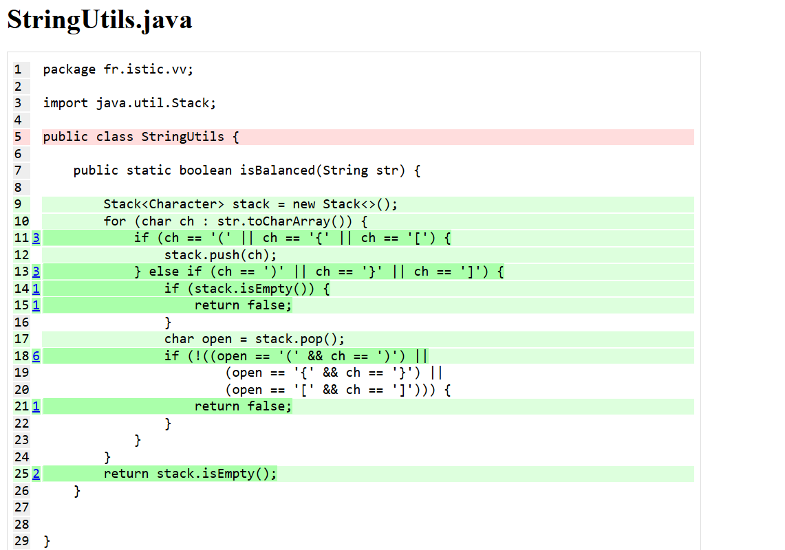

# Balanced strings

A string containing grouping symbols `{}[]()` is said to be balanced if every open symbol `{[(` has a matching closed symbol `)]}` and the substrings before, after and between each pair of symbols is also balanced. The empty string is considered as balanced.

For example: `{[][]}({})` is balanced, while `][`, `([)]`, `{`, `{(}{}` are not.

Implement the following method:

```java
public static boolean isBalanced(String str) {
    ...
}
```

`isBalanced` returns `true` if `str` is balanced according to the rules explained above. Otherwise, it returns `false`.

Use the coverage criteria studied in classes as follows:

1. Use input space partitioning to design an initial set of inputs. Explain below the characteristics and partition blocks you identified.
2. Evaluate the statement coverage of the test cases designed in the previous step. If needed, add new test cases to increase the coverage. Describe below what you did in this step.
3. If you have in your code any predicate that uses more than two boolean operators, check if the test cases written so far satisfy *Base Choice Coverage*. If needed, add new test cases. Describe below how you evaluated the logic coverage and the new test cases you added.
4. Use PIT to evaluate the test suite you have so far. Describe below the mutation score and the live mutants. Add new test cases or refactor the existing ones to achieve a high mutation score.

Write below the actions you took on each step and the results you obtained.
Use the project in [tp3-balanced-strings](../code/tp3-balanced-strings) to complete this exercise.

## Answer

1.  J'ai pu trouvé 2 caractéristiques : 

    |                                             |Même nombre    |Pas le même nombre|
    |---------------------------------------------|---------------|------------------|
    | Nombre de parenthesis ouvrante et fermante  |"","{}"        |"(","{(}"         |

    |                                             |Croisé         |Pas croisé        |
    |---------------------------------------------|---------------|------------------|
    | Imbrication                                 |"{(})"         |"{()}"            |

    Ceci qui me permet d'avoir les tests suivant :

    ```java
    //Test avec une string vide
    @Test
    public void testIsBalancedEmptyString() {
        assertTrue(StringUtils.isBalanced(""));
    }

    //Test avec une string contenant "("
    @Test
    public void testIsBalancedOneParenthesisOpen() {
        assertFalse(StringUtils.isBalanced("("));
    }

    //Test avec une string contenant "{}"
    @Test
    public void testIsBalancedParenthesBalanced() {
        assertFalse(StringUtils.isBalanced("{}"));
    }

    //Test avec une string contenant "{(}"
    @Test
    public void testIsBalancedParenthesNotBalanced() {
        assertFalse(StringUtils.isBalanced("{(}"));
    }

    //Test avec une string contenant "{(})"
    @Test
    public void testIsBalancedParenthesCroise() {
        assertFalse(StringUtils.isBalanced("{(})"));
    }

    //Test avec une string contenant "{()}"
    @Test
    public void testIsBalancedParenthesNotCroise() {
        assertFalse(StringUtils.isBalanced("{()}"));
    }


    ```

    Avec cette suite de test on obtient un coverage de 90% :

    

2.  Il manque 1 test pour pouvoir passer à un coverage de 100% et c'est celui ci :
    ```java 
        @Test
    public void tesIsBalancedParenthesisCurlyBracketClosed(){
        assertFalse(StringUtils.isBalanced("]"));
    }
    ```
    On ne rentrer pas dans la condition stack.isEmpty() après un parenthesis fermante Et voila le coverage :
    


3. J'ai plusieurs condition qui contiennent plus de 2 opérateur. 

pour la premiere condition ``  (ch == '(' || ch == '{' || ch == '[') ``

| `ch`  | `ch == '('` | `ch == '{'` | `ch == '['` | Résultat attendu |
|-------|-------------|-------------|-------------|------------------|
| `(`   | true        | false       | false       | true             |
| `{`   | false       | true        | false       | true             |
| `[`   | false       | false       | true        | true             |

Pour ce tableau il faut donc, pour couvrir la condition 3 tests : 

```java
    //Test avec une string contenant "("
    @Test
    public void testIsBalancedParenthesisOpen() {
        assertFalse(StringUtils.isBalanced("("));
    }

    //Test avec une string contenant "{"
    @Test
    public void testIsBalancedCurlyOpen() {
        assertFalse(StringUtils.isBalanced("{"));
    }

    //Test avec une string contenant "["
    @Test
    public void testIsBalancedSquareOpen() {
        assertFalse(StringUtils.isBalanced("["));
    }
```


pour la deuxieme condition ``  (ch == ')' || ch == '}' || ch == ']') ``

| `ch`  | `ch == ')'` | `ch == '}'` | `ch == ']'` | Résultat attendu |
|-------|-------------|-------------|-------------|------------------|
| `)`   | true        | false       | false       | true             |
| `}`   | false       | true        | false       | true             |
| `]`   | false       | false       | true        | true             |

Pour celui la il faut donc, pour couvrir la condition 3 tests : 

```java
    //Test avec une string contenant ")"
    @Test
    public void testIsBalancedParenthesisClosed() {
        assertFalse(StringUtils.isBalanced(")"));
    }

    //Test avec une string contenant "}"
    @Test
    public void testIsBalancedCurlyClosed() {
        assertFalse(StringUtils.isBalanced("}"));
    }

    //Test avec une string contenant "]"
    @Test
    public void testIsBalancedSquareClosed() {
        assertFalse(StringUtils.isBalanced("]"));
    }
```

pour la troisieme condition ``  (!((open == '(' && ch == ')') || (open == '{' && ch == '}') ||(open == '[' && ch == ']'))) ``

| `open` | `ch`  | `open == '(' && ch == ')'` | `open == '{' && ch == '}'` | `open == '[' && ch == ']'` | Résultat attendu |
|--------|-------|----------------------------|----------------------------|----------------------------|------------------|
| `(`    | `}`   | false                      | false                      | false                      | true             |
| `{`    | `]`   | false                      | false                      | false                      | true             |
| `[`    | `)`   | false                      | false                      | false                      | true             |
| `(`    | `]`   | false                      | false                      | false                      | true             |
| `{`    | `)`   | false                      | false                      | false                      | true             |
| `[`    | `}`   | false                      | false                      | false                      | true             |

pour couvrir cette condition je dois ajouter ces tests :
```java
    //Test avec une string contenant "(}"
    @Test
    public void testIsBalancedParenthesisNormalOpenClurlyClosed() {
        assertFalse(StringUtils.isBalanced("(}"));
    }

    //Test avec une string contenant "{]"
    @Test
    public void testIsBalancedCurlyOpenClosedSquareClosed() {
        assertFalse(StringUtils.isBalanced("{]"));
    }

    //Test avec une string contenant "[)"
    @Test
    public void testIsBalancedSquareOpenNormalClosed() {
        assertFalse(StringUtils.isBalanced("[)"));
    }

    //Test avec une string contenant "(]"
    @Test
    public void testIsBalancedNormalOpenSquareClosed() {
        assertFalse(StringUtils.isBalanced("(]"));
    }

    //Test avec une string contenant "{)"
    @Test
    public void testIsBalancedCurlyOpenNormalClosed() {
        assertFalse(StringUtils.isBalanced("{)"));
    }

    //Test avec une string contenant "[}"
    @Test
    public void testIsBalancedSquareOpenCurlyClosed() {
        assertFalse(StringUtils.isBalanced("[}"));
    }
```

J'ai ensuite tester avec JaCoCo et j'obtient un coverage de branch de 92% 


J'ai donc rajouté ces tests pour atteindre 100% :

```java
    //Test avec une string contenant "a]"
    @Test
    public void testIsBalancedRandomCharParenthesisRandomClosed() {
        assertFalse(StringUtils.isBalanced("a]"));
    }

    //Test avec une string contenant "[]"
    @Test
    public void testIsBalancedParenthesisSquareOpenClosed() {
        assertTrue(StringUtils.isBalanced("[]"));
    }

```

4. 
    J'obtient un score de 100% de mutation avec un coverage des muttants de 92% :
    


    ```
    - Statistics
    >> Line Coverage (for mutated classes only): 11/12 (92%)
    >> Generated 17 mutations Killed 17 (100%)
    >> Mutations with no coverage 0. Test strength 100%
    >> Ran 28 tests (1.65 tests per mutation)
    Enhanced functionality available at https://www.arcmutate.com/
    ```


