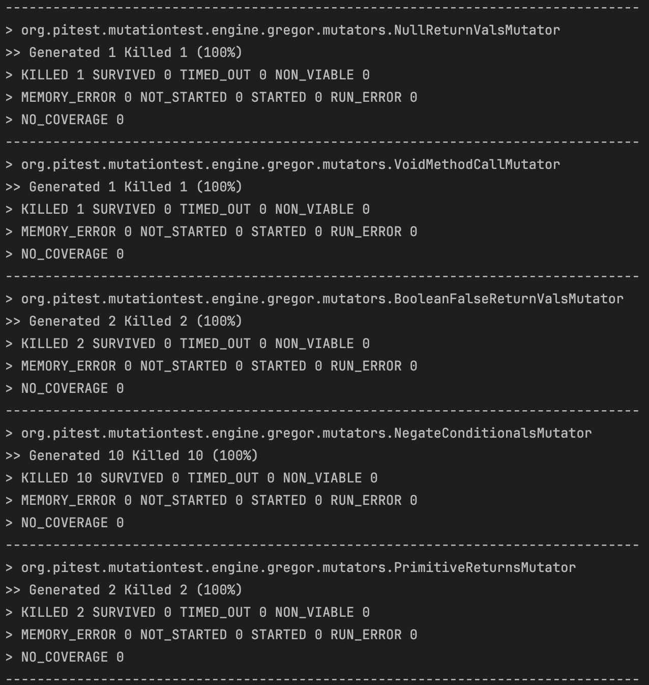

# Balanced strings

A string containing grouping symbols `{}[]()` is said to be balanced if every open symbol `{[(` has a matching closed symbol `)]}` and the substrings before, after and between each pair of symbols is also balanced. The empty string is considered as balanced.

For example: `{[][]}({})` is balanced, while `][`, `([)]`, `{`, `{(}{}` are not.

Implement the following method:

```java
public static boolean isBalanced(String str) {
    ...
}
```

`isBalanced` returns `true` if `str` is balanced according to the rules explained above. Otherwise, it returns `false`.

Use the coverage criteria studied in classes as follows:

1. Use input space partitioning to design an initial set of inputs. Explain below the characteristics and partition blocks you identified.

| Partition                  | Description                                      | Example Inputs                | Expected Output |
|----------------------------|--------------------------------------------------|-------------------------------|-----------------|
| Null Input                 | `str` is `null`                                  | `null`                        | Exception       |
| Empty String               | `str` is an empty string                         | `""`                          | `true`          |
| Single Bracket             | `str` contains a single bracket                  | `"("`, `")"`, `"{"`, `"}"`, `"["`, `"]"` | `false`         |
| Balanced Brackets          | `str` contains balanced brackets                 | `"()"`, `"{}"`, `"[]"`, `"( { [ ] } )"` | `true`          |
| Unbalanced Brackets        | `str` contains unbalanced brackets               | `"(]"`, `"( { [ } )"`         | `false`         |
| Non-Bracket Characters     | `str` contains non-bracket characters            | `"abc"`, `"123"`, `"abc123"`  | `true`          |
| Mixed Characters           | `str` contains a mix of bracket and non-bracket characters | `"(a[b{c}d]e)"`, `"(a[b{c}d]e"` | `true`, `false` |
| Strings with Spaces        | `str` contains spaces along with brackets and/or other characters | `" ( ) "`, `" { } "`, `" [ ] "`, `"( { [ ] } )"` | `true`, `false` |

2. Evaluate the statement coverage of the test cases designed in the previous step. If needed, add new test cases to increase the coverage. Describe below what you did in this step.


3. If you have in your code any predicate that uses more than two boolean operators, check if the test cases written so far satisfy *Base Choice Coverage*. If needed, add new test cases. Describe below how you evaluated the logic coverage and the new test cases you added.

4. Use PIT to evaluate the test suite you have so far. Describe below the mutation score and the live mutants. Add new test cases or refactor the existing ones to achieve a high mutation score.

Below is a screenshot of the results of the PIT analysis. It can be seen that 19 mutants were generated, all of which were successfully killed, showing that the existing test set is sufficiently robust. However, this does not prove that the code is bugfree.



