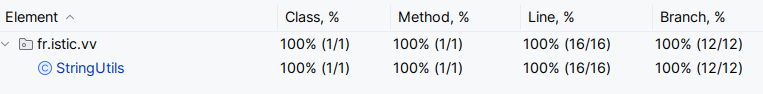

# Balanced strings

A string containing grouping symbols `{}[]()` is said to be balanced if every open symbol `{[(` has a matching closed symbol `)]}` and the substrings before, after and between each pair of symbols is also balanced. The empty string is considered as balanced.

For example: `{[][]}({})` is balanced, while `][`, `([)]`, `{`, `{(}{}` are not.

Implement the following method:

```java
public static boolean isBalanced(String str) {
    ...
}
```

`isBalanced` returns `true` if `str` is balanced according to the rules explained above. Otherwise, it returns `false`.

Use the coverage criteria studied in classes as follows:

1. Use input space partitioning to design an initial set of inputs. Explain below the characteristics and partition blocks you identified.
2. Evaluate the statement coverage of the test cases designed in the previous step. If needed, add new test cases to increase the coverage. Describe below what you did in this step.
3. If you have in your code any predicate that uses more than two boolean operators, check if the test cases written so far satisfy *Base Choice Coverage*. If needed, add new test cases. Describe below how you evaluated the logic coverage and the new test cases you added.
4. Use PIT to evaluate the test suite you have so far. Describe below the mutation score and the live mutants. Add new test cases or refactor the existing ones to achieve a high mutation score.

Write below the actions you took on each step and the results you obtained.
Use the project in [tp3-balanced-strings](../code/tp3-balanced-strings) to complete this exercise.

## Answer
____
1. Les cas à traiter sont les suivants
    - L'input est vide : `str = ""`
    - L'input contient un seul char : `str = {"(", "[", "{", ")", "]", "}"}`
    - L'input contient un nombre pair de char et les symboles ouvrants et ferment sont OK : `str = {"{}", "()", "[]", "([]{})", "{[({})]}", "{{}}"}`
    - L'input contient un nombre impair de char : `str = {"{{}", "{}}"}`
    - L'input contient un des symboles ouvrants qui ne sont pas correctement fermés : `str = {"{)", "{]", "[}", "[)", "(]", "(}"}`
____
2. Avec l'outil de Coverage d'Intellij :


Le line coverage est à 100%, je pense qu'il n'y a pas besoin d'ajouter de cas de tests en l'état.
____
3. La condition du else if à la ligne 34 : `j<0 || pile[j] != curr`

| Test Case | `j < 0`  | `pile[j] != curr`   | Résultat        |
|-----------|----------|---------------------|-----------------|
| TC1       | true     | false               | true            |
| TC2       | false    | false               | false           |
| TC3       | false    | true                | true            |
| TC4       | false    | false               | false           |

Pour évaluer cette condition, on est nécessairement dans le cas où `curr != '(' && curr != '{' && curr != '['`.
On découpe dans la table si dessus les valeurs de tous les bouléens qui impactent le résultat de la conditionnelle, ici TC2 et TC4 sont identique, on n'en gardera qu'un. 

Les cas de tests associés sont :
```java
// j < 0 :
@Test
void testSingleCloseParenthesis() {
    assertFalse(isBalanced(")"));
}

@Test
void testSingleCloseBracket() {
    assertFalse(isBalanced("]"));
}

@Test
void testSingleCloseBrace() {
    assertFalse(isBalanced("}"));
}

// pile[j] != curr :
@Test
void testUnbalancedMismatchedPair1() {
    assertFalse(isBalanced("(]"));
}

@Test
void testUnbalancedMismatchedPair2() {
    assertFalse(isBalanced("([)]"));
}

@Test
void testUnbalancedMismatchedPair3() {
    assertFalse(isBalanced("{[}]"));
}
// ...
```
____
4. Exécution de PIT :


Les résultats sont concluants !