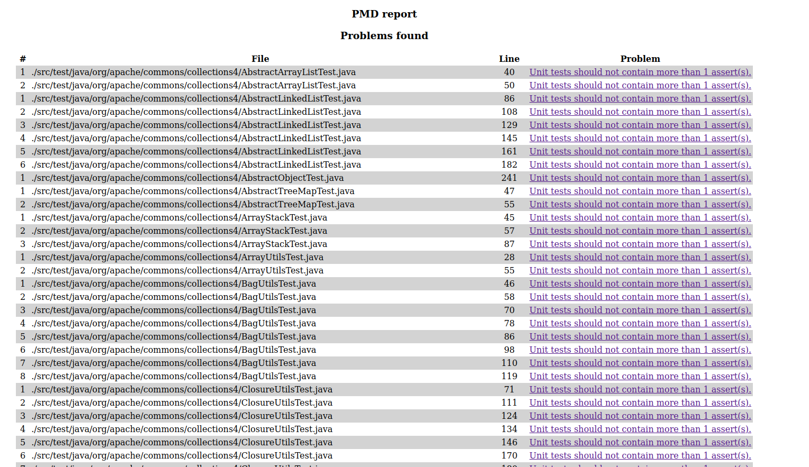
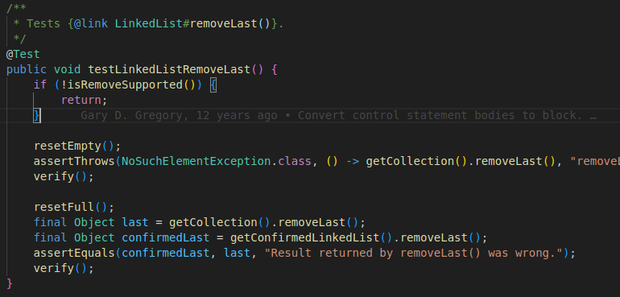

# Detecting test smells with PMD

In folder [`pmd-documentation`](../pmd-documentation) you will find the documentation of a selection of PMD rules designed to catch test smells.
Identify which of the test smells discussed in classes are implemented by these rules.

Use one of the rules to detect a test smell in one of the following projects:

- [Apache Commons Collections](https://github.com/apache/commons-collections)
- [Apache Commons CLI](https://github.com/apache/commons-cli)
- [Apache Commons Math](https://github.com/apache/commons-math)
- [Apache Commons Lang](https://github.com/apache/commons-lang)

Discuss the test smell you found with the help of PMD and propose here an improvement.
Include the improved test code in this file.

## Answer
Parmis les code-smells vus en cours :
* Un test doit contenir un message, un commentaire : [UnitTestAssertionsShouldIncludeMessage](../pmd-documentation/UnitTestAssertionsShouldIncludeMessage.md)
* Utiliser les bons assert pour faire les bons tests :
    - [UseAssertEqualsInsteadOfAssertTrue](../pmd-documentation/UseAssertEqualsInsteadOfAssertTrue.md)
    - [UseAssertNullInsteadOfAssertTrue](../pmd-documentation/UseAssertNullInsteadOfAssertTrue.md)
    - [UseAssertSameInsteadOfAssertTrue](../pmd-documentation/UseAssertSameInsteadOfAssertTrue.md)
    - [UseAssertTrueInsteadOfAssertEquals](../pmd-documentation/UseAssertTrueInsteadOfAssertEquals.md)

* Un cas de test doit contenir un unique scénario (+ intialisation input + oracle + commentaire) : [UnitTestContainsTooManyAsserts](../pmd-documentation/UnitTestContainsTooManyAsserts.md)


En testant la libraire _commons-collections_ avec la règle ci dessus:
```bash
pmd check -d ./src/ -R category/java/bestpractices.xml/UnitTestContainsTooManyAsserts -f html -r ../pmd-report-smell.html
```

On obtient le rapport suivant :


Voici un exemple de code smell dans le code (il y a ici 2 asserts):


