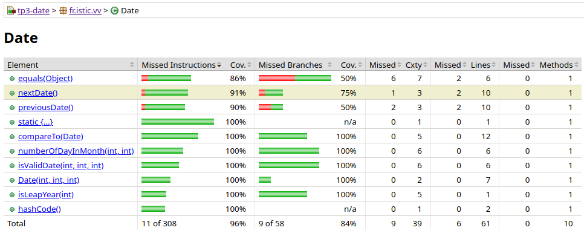
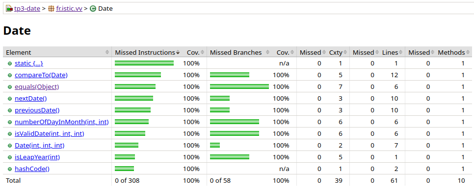

# Test the Date class

Implement a class `Date` with the interface shown below:

```java
class Date implements Comparable<Date> {

    public Date(int day, int month, int year) { ... }

    public static boolean isValidDate(int day, int month, int year) { ... }

    public static boolean isLeapYear(int year) { ... }

    public Date nextDate() { ... }

    public Date previousDate { ... }

    public int compareTo(Date other) { ... }

}
```

The constructor throws an exception if the three given integers do not form a valid date.

`isValidDate` returns `true` if the three integers form a valid year, otherwise `false`.

`isLeapYear` says if the given integer is a leap year.

`nextDate` returns a new `Date` instance representing the date of the following day.

`previousDate` returns a new `Date` instance representing the date of the previous day.

`compareTo` follows the `Comparable` convention:

* `date.compareTo(other)` returns a positive integer if `date` is posterior to `other`
* `date.compareTo(other)` returns a negative integer if `date` is anterior to `other`
* `date.compareTo(other)` returns `0` if `date` and `other` represent the same date.
* the method throws a `NullPointerException` if `other` is `null`.

Design and implement a test suite for this `Date` class.
You may use the test cases discussed in classes as a starting point.
Also, feel free to add any extra method you may need to the `Date` class.

Use the following steps to design the test suite:

1. With the help of *Input Space Partitioning* design a set of initial test inputs for each method. Write below the characteristics and blocks you identified for each method. Specify which characteristics are common to more than one method.
2. Evaluate the statement coverage of the test cases designed in the previous step. If needed, add new test cases to increase the coverage. Describe below what you did in this step.
3. If you have in your code any predicate that uses more than two boolean operators check if the test cases written to far satisfy *Base Choice Coverage*. If needed add new test cases. Describe below how you evaluated the logic coverage and the new test cases you added.
4. Use PIT to evaluate the test suite you have so far. Describe below the mutation score and the live mutants. Add new test cases or refactor the existing ones to achieve a high mutation score.

Use the project in [tp3-date](../code/tp3-date) to complete this exercise.

## Answer

1- Partitionnons l'espace d'entrée selon les valeurs de chaque entier (year, month, day).
Ainsi on aura une partition sur year, une sur month et une sur day qu'on utilisera selon la pertinence.

Pour isLeapYear :

| Characteristics | Blocks       |   |                    |  |
|-----------------|--------------|---|--------------------|--|
|  year |  < 0 | 0 | année bissextile   | année normale   |

Pour isValideDate; nextDate et previousDate

| Characteristics | Blocks |       |             |  |       ||
|-----------------|--------|-------|-------------|--|-------|-|
|  year |  < 0 | 0  | année bissextile              | année normale       |    ||
|  month | < 0 | 0  | {1, 3, 5, 7, 8, 10, 12}       | {4, 6, 9, 11}       | 2  | \> 12 |
|  day   | < 0 | 0  | \>= 1 and <= max(month, year) | \> max(month, year) |    ||

pour constructeur :

| Characteristics     | Blocks |    |
|---------------------|-------|-----|
| validité de la date | oui   | non |

pour compareTo :

| Characteristics                | Blocks            |          |    |
|--------------------------------|-------------------|----------|----|
| comparaison seconde date  null | null | non null |    |
| comparaison year               | \>                | ==       | \< |
| comparaison month              | \>                | ==       | \< |
| comparaison day                | \>                | ==       | \< |  

Pour isValidDate, nextDate et currentDate le partitionnement d'input peut être le même car il faut tester beaucoup de conditions.

Les partitions sur les années pour leapYear est commune avec les méthodes ci-dessus.

Je ne mets pas plus de caracteristiques sur le constructeur car ses sorties possibles dépendent de IsValidaDate.

Le constructeur est testé au travers des tests des différentes méthodes.

Ma batterie de test m'a permis de me rendre compte d'une erreur dans la méthode previousDate dans laquelle je n'utilisais pas __newYear et newMonth__ pour calculer la nouvelle journée mais __year et month__ ce qui provoquait une erreur.

J'ai parfois regroupé plusieurs assert qui vérifient le me sous-ensemble d'une partition afin de favoriser la lisibilité du code déjà bien fournis pour les tests.
Je sais que ce n'est pas forcement une bonne pratique mais je considère que dans ce cas cela fait sens.
exemple :

```java
     @Test
    void testLeapNegativeYear() {
        // Partition: < 0
        assertFalse(Date.isLeapYear(-1), "-1 should not be a leap year");
        assertFalse(Date.isLeapYear(-400), "-400 should not be a leap year even though can be divided by 400");
    }
```

Certaines variantes de tests ont été généré à l'aide d'une IA pour éviter une réécriture longue et rebarbative en lui fournissant un exemple et en lui demandant de le décliner pour différentes valeurs d'une partitions.

L'echec de certains tests m'a fait penser qu'il fallait aussi que j'implément une méthode equals et hascode pour comparer mes objets. En effet en debuggant je me suis rendus compte que des meme date n'etait pas égale dans les asserts.

Je n'ai pas réalisé de partitionnement pour ces deux méthodes. J'ai simplement fait un test de verification de calcul pour hascode et je verrais au coverage ce qui est déjà testé pour la méthode equals.

J'ai rajouté des tests pour la fonction numberOfDayInMonth() selon la partition suivante :

| Characteristics | Blocks       |   |                    |  |||
|-----------------|--------------|---|--------------------|--|-|-|
|  year |  < 0 | 0 | année bissextile   | année normale   |
|  month | < 0 | 0  | {1, 3, 5, 7, 8, 10, 12}       | {4, 6, 9, 11}       | 2  | \> 12 |

Je pense avoir été un peu ambitieux sur le nombre de partitions pour chaque émthode et j'avoue avoir un pe perdu le fil  par moment de qu'elle test encore implémenté.
Il en manque peut être quelqu'uns par erreur d'innatention. Je compte sur les prochaines parties pour m'en rendre compte.

2- Voila le coverage après cette premiere batterie de test :


Le coverage est dans l'ensemble trés bon !
Je vais essayer de le compléter en regarder qu'elles sont les embranchements non pris et les lignes non pourvues en test !
J'ai ajouté des tests pour les méthodes equals nextDate et previousDate. Nottament pour le changement de mois ou d'année avec nextDate et previousDate.

Voici le coverage a présent :


Il est à 100% partout et toutes les branches sont bien évaluées.


3- En regardant mon code en ayant en tetet les differentes possibilités pour les méthodes avec le base choice coverage, j'ai l'impression d'avoir parcourue tout les cas liés au "base choice coverage" pour les méthodes le nécessitant je pense particulièrement à validateYear et leapYear. 

4- Voici ma première analyse avec PIT : 

```bash
================================================================================
- Mutators
================================================================================
> org.pitest.mutationtest.engine.gregor.mutators.BooleanTrueReturnValsMutator
>> Generated 6 Killed 6 (100%)
> KILLED 6 SURVIVED 0 TIMED_OUT 0 NON_VIABLE 0 
> MEMORY_ERROR 0 NOT_STARTED 0 STARTED 0 RUN_ERROR 0 
> NO_COVERAGE 0 
--------------------------------------------------------------------------------
> org.pitest.mutationtest.engine.gregor.mutators.ConditionalsBoundaryMutator
>> Generated 14 Killed 9 (64%)
> KILLED 9 SURVIVED 5 TIMED_OUT 0 NON_VIABLE 0 
> MEMORY_ERROR 0 NOT_STARTED 0 STARTED 0 RUN_ERROR 0 
> NO_COVERAGE 0 
--------------------------------------------------------------------------------
> org.pitest.mutationtest.engine.gregor.mutators.IncrementsMutator
>> Generated 5 Killed 5 (100%)
> KILLED 5 SURVIVED 0 TIMED_OUT 0 NON_VIABLE 0 
> MEMORY_ERROR 0 NOT_STARTED 0 STARTED 0 RUN_ERROR 0 
> NO_COVERAGE 0 
--------------------------------------------------------------------------------
> org.pitest.mutationtest.engine.gregor.mutators.NullReturnValsMutator
>> Generated 2 Killed 2 (100%)
> KILLED 2 SURVIVED 0 TIMED_OUT 0 NON_VIABLE 0 
> MEMORY_ERROR 0 NOT_STARTED 0 STARTED 0 RUN_ERROR 0 
> NO_COVERAGE 0 
--------------------------------------------------------------------------------
> org.pitest.mutationtest.engine.gregor.mutators.MathMutator
>> Generated 14 Killed 14 (100%)
> KILLED 14 SURVIVED 0 TIMED_OUT 0 NON_VIABLE 0 
> MEMORY_ERROR 0 NOT_STARTED 0 STARTED 0 RUN_ERROR 0 
> NO_COVERAGE 0 
--------------------------------------------------------------------------------
> org.pitest.mutationtest.engine.gregor.mutators.BooleanFalseReturnValsMutator
>> Generated 1 Killed 1 (100%)
> KILLED 1 SURVIVED 0 TIMED_OUT 0 NON_VIABLE 0 
> MEMORY_ERROR 0 NOT_STARTED 0 STARTED 0 RUN_ERROR 0 
> NO_COVERAGE 0 
--------------------------------------------------------------------------------
> org.pitest.mutationtest.engine.gregor.mutators.NegateConditionalsMutator
>> Generated 29 Killed 29 (100%)
> KILLED 29 SURVIVED 0 TIMED_OUT 0 NON_VIABLE 0 
> MEMORY_ERROR 0 NOT_STARTED 0 STARTED 0 RUN_ERROR 0 
> NO_COVERAGE 0 
--------------------------------------------------------------------------------
> org.pitest.mutationtest.engine.gregor.mutators.PrimitiveReturnsMutator
>> Generated 6 Killed 6 (100%)
> KILLED 6 SURVIVED 0 TIMED_OUT 0 NON_VIABLE 0 
> MEMORY_ERROR 0 NOT_STARTED 0 STARTED 0 RUN_ERROR 0 
> NO_COVERAGE 0 
--------------------------------------------------------------------------------
================================================================================
- Timings
================================================================================
> scan classpath : < 1 second
> coverage and dependency analysis : 1 seconds
> build mutation tests : < 1 second
> run mutation analysis : 3 seconds
--------------------------------------------------------------------------------
> Total  : 4 seconds
--------------------------------------------------------------------------------
================================================================================
- Statistics
================================================================================
>> Generated 77 mutations Killed 72 (94%)
>> Ran 272 tests (3.53 tests per mutation)
[INFO] ------------------------------------------------------------------------
[INFO] BUILD SUCCESS
[INFO] ------------------------------------------------------------------------
[INFO] Total time:  6.441 s
[INFO] Finished at: 2024-12-12T13:32:58+01:00
[INFO] ------------------------------------------------------------------------
```

Avec un score de 94% je pense que ma suite de test est de bonne qualité !
Essayons tout de même de l'améliorer.
Les seuls mutants qui ne sont pas tués appartiennent à cette catégorie : 

```bash
> org.pitest.mutationtest.engine.gregor.mutators.ConditionalsBoundaryMutator
>> Generated 14 Killed 9 (64%)
> KILLED 9 SURVIVED 5 TIMED_OUT 0 NON_VIABLE 0 
```

Les mutants qui survivaient le faisait sur des transformation de < en <= . Il étaient présent pour les fonctions nextDate et previousDate dans des cas trés particulier comme le retour en janvier (le mois passe de <1 à <=1). J'ai rajouté des cas de tests la couverture est maintenant de 100 de mutants tués.

```bash
================================================================================
- Statistics
================================================================================
>> Generated 77 mutations Killed 77 (100%)
```