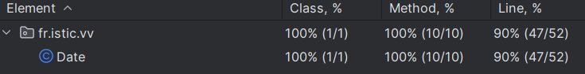
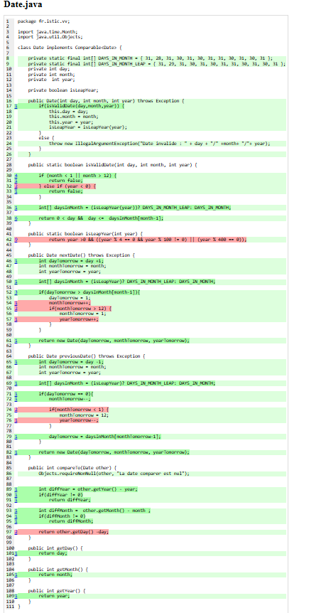

# Test the Date class

Implement a class `Date` with the interface shown below:

```java
class Date implements Comparable<Date> {

    public Date(int day, int month, int year) { ... }

    public static boolean isValidDate(int day, int month, int year) { ... }

    public static boolean isLeapYear(int year) { ... }

    public Date nextDate() { ... }

    public Date previousDate { ... }

    public int compareTo(Date other) { ... }

}
```

The constructor throws an exception if the three given integers do not form a valid date.

`isValidDate` returns `true` if the three integers form a valid year, otherwise `false`.

`isLeapYear` says if the given integer is a leap year.

`nextDate` returns a new `Date` instance representing the date of the following day.

`previousDate` returns a new `Date` instance representing the date of the previous day.

`compareTo` follows the `Comparable` convention:

* `date.compareTo(other)` returns a positive integer if `date` is posterior to `other`
* `date.compareTo(other)` returns a negative integer if `date` is anterior to `other`
* `date.compareTo(other)` returns `0` if `date` and `other` represent the same date.
* the method throws a `NullPointerException` if `other` is `null` 

Design and implement a test suite for this `Date` class.
You may use the test cases discussed in classes as a starting point. 
Also, feel free to add any extra method you may need to the `Date` class.


Use the following steps to design the test suite:

1. With the help of *Input Space Partitioning* design a set of initial test inputs for each method. Write below the characteristics and blocks you identified for each method. Specify which characteristics are common to more than one method.
2. Evaluate the statement coverage of the test cases designed in the previous step. If needed, add new test cases to increase the coverage. Describe below what you did in this step.
3. If you have in your code any predicate that uses more than two boolean operators check if the test cases written to far satisfy *Base Choice Coverage*. If needed add new test cases. Describe below how you evaluated the logic coverage and the new test cases you added.
4. Use PIT to evaluate the test suite you have so far. Describe below the mutation score and the live mutants. Add new test cases or refactor the existing ones to achieve a high mutation score.

Use the project in [tp3-date](../code/tp3-date) to complete this exercise.

## Answer


1. 

Pour l'objet date j'ai pu trouver 3 caractéristique :

    |                                             |Valide         |Pas valide          |
    |---------------------------------------------|---------------|--------------------|
    | Une date contient un mois valide            |"1","12"       |"13","0"            |
    | Une date contient une année valide          |"1","2025"     |"-1"                |
    | Une date contient un jour valide            |"1","maxOfMonth"|"0", "maxOfMonth+1"|

    Ceci qui me permet d'avoir les tests suivant qui tests la méthode isValidDate et le constructeur qui throw :

```java

    //Test avec une date dont le mois est valide
    @Test
    public void testDateValidMonth() {
        assertDoesNotThrow(() ->new Date(1, 1, 1));
    }

    //Test avec une date dont le mois est valide
    @Test
    public void testDateValidMonth2() {
        assertDoesNotThrow(() ->new Date(1, 12, 1));
    }

    //Test avec une date dont le mois est pas valide
    @Test
    public void testDateNotValidMonth() {
        assertThrows(IllegalArgumentException.class, () ->new Date(1, 0, 1));
    }

    //Test avec une date dont le mois est pas valide
    @Test
    public void testDateNotValidMonth2() {
        assertThrows(IllegalArgumentException.class, () ->new Date(1, 13, 1));
    }

    //Test avec une date dont l'année est pas valide
    @Test
    public void testDateValidYear() {
        assertDoesNotThrow(() ->new Date(1, 1, 1));
    }

    //Test avec une date dont l'année est pas valide
    @Test
    public void testDateValidYear2() {
        assertDoesNotThrow(() ->new Date(1, 1, 2025));
    }

    //Test avec une date dont l'année est pas valide
    @Test
    public void testDateNotValidYear() throws Exception {
        assertThrows(IllegalArgumentException.class, () -> new Date(1, 1, -1));
    }

    //Test avec une date dont le jour est pas valide
    @Test
    public void testDateValidDay() {
        assertDoesNotThrow(() ->new Date(1, 1, 1));
    }

    //Test avec une date dont le jour est pas valide
    @Test
    public void testDateValidDay2() {
        assertDoesNotThrow(() ->new Date(31, 1, 1));
    }

    //Test avec une date dont le jour est pas valide
    @Test
    public void testDateNotValidDay() {
        assertThrows(IllegalArgumentException.class, () ->new Date(0, 1, 1));
    }

    //Test avec une date dont le jour est pas valide
    @Test
    public void testDateNotValidDay2() {
        assertThrows(IllegalArgumentException.class, () ->new Date(32, 1, 1));
    }

```
Pour la méthode isLeapYear :

    |                                             |Bissextile   |Pas bissextile|
    | Une année est bissextile ou non             |"2024"       |"2023"        |

    |                                             |Valide       |Pas valide   |
    | Une année est valide                        |"2024"       |"-2024"      |

    Ceci qui me permet d'avoir les tests suivant

    ```java

     //Test avec une date dont l'année est bissextile et valide
    @Test
    public void testIsLeapYearDateBissextile() {
        assertTrue(Date.isLeapYear(2024));
    }

    //Test avec une date dont l'année n'est pas bissextile
    @Test
    public void testIsLeapYearDateNotBissextile() {
        assertFalse(Date.isLeapYear(2023));
    }

    //Test avec une date dont l'année n'est pas bissextile et pas valide
    @Test
    public void testIsLeapYearDateNotBissextile2() {
        assertFalse(Date.isLeapYear(-1));
    }

    ```

Pour la méthode nextDate :

    |                                                                    |Bissextile    |Pas bissextile |
    | Jour suivant du 28/02 d'une année bissextile                       |"29/02"       |"01/03"        |


    Ceci qui me permet d'avoir le test suivant

    ```java
   //Test date suivante de 28/02 sur une année bissextile
    @Test
    public void testNextDateBissextile() throws Exception {
        Date date = new Date(28, 02 ,2024);
        assertTrue(date.nextDate().getDay() == 29);
    }

    //Test date suivante de 29/02 sur une année normal
    @Test
    public void testNextDateNormal() throws Exception {
        Date date = new Date(28, 02 ,2023);
        assertTrue(date.nextDate().getDay() == 01);
    }
    ```


Pour la méthode previousDate :

    |                                                                    |Bissextile    |Pas bissextile |
    | Jour précédent du 01/03 d'une année bissextile                     |"29/02"       |"28/02"        |


    Ceci qui me permet d'avoir le test suivant

    ```java
   //Test date suivante de 28/02 sur une année bissextile
    @Test
    public void testPreviousDateBissextile() throws Exception {
        Date date = new Date(1, 3 ,2024);
        assertTrue(date.previousDate().getDay() == 29);
    }

    //Test date suivante de 29/02 sur une année normal
    @Test
    public void testPreviousDateNormal() throws Exception {
        Date date = new Date(1, 3 ,2023);
        assertTrue(date.previousDate().getDay() == 28);
    }
    ```

Pour la méthode compareTo :

    |                                                              |Supp à 0                  |Inf à 0     | Egal à 0   |
    | Signe en fonction de la différence         pour 29/02/2024   |"01/03/2024", "01/03/2025"|"29/01/2024"|"29/02/2024"|

Ceci qui me permet d'avoir le test suivant

    ```java
    //Test date compare 29/02/2024 et 30/03/2024
    @Test
    public void testCompareToSupp() throws Exception {
        Date date = new Date(29, 2 ,2024);
        assertTrue(date.compareTo(new Date(30, 3 ,2024)) > 0);
    }

    //Test date compare 29/02/2024 et 30/03/2025
    @Test
    public void testCompareToSupp2() throws Exception {
        Date date = new Date(29, 2 ,2024);
        assertTrue(date.compareTo(new Date(30, 3 ,2025)) > 0);
    }

    //Test date compare 29/02/2024 et 29/01/2024
    @Test
    public void testCompareToInf() throws Exception {
        Date date = new Date(29, 2 ,2024);
        assertTrue(date.compareTo(new Date(29, 1 ,2024)) < 0);
    }

    //Test date compare 29/02/2024 et 29/02/2024
    @Test
    public void testCompareToEg() throws Exception {
        Date date = new Date(29, 2 ,2024);
        assertTrue(date.compareTo(new Date(29, 2 ,2024)) == 0);
    }
    ```
    
2. J'obtient donc un coverage de 90% :

    

    il manquait donc le cas du 31/12 :

    ```java
    //Test date suivante de 31/12 sur une année normal
    @Test
    public void testNextDateNormal2() throws Exception {
        Date date = new Date(31, 12 ,2023);
        assertTrue(date.nextDate().getDay() == 1);
    }

    //Test date precedant de 01/01 sur une annee normal
    @Test
    public void testPreviousDateNormal2() throws Exception {
        Date date = new Date(1, 1 ,2023);
        assertTrue(date.previousDate().getDay() == 31);
    }
    ``` 

    Et avec une simplification dans la fonction compareTo sur la différence de jour je passe à 100% de coverage

3. En utilisant JaCoCo j'observe que mon coverage de branch est de 92%
    j'ajoute donc les tests suivants pour l'augmenter :

    ```java

    //Test avec une date dont l'annee est bissextile car divisible par 400
    @Test
    public void testIsLeapYearDateBissextile2() {
        assertTrue(Date.isLeapYear(2000 ));
    }

     //Test date precedant de 01/02 sur une annee normal
    @Test
    public void testPreviousDateNormal3() throws Exception {
        Date date = new Date(1, 2 ,2023);
        assertTrue(date.previousDate().getDay() == 31);
    }

    //Test date precedant de 05/01 sur une annee normal
    @Test
    public void testPreviousDateNormal4() throws Exception {
        Date date = new Date(5, 1 ,2023);
        assertTrue(date.previousDate().getDay() == 4);
    }
    ```

4. Une Pit lancé j'obtiens :
    

    Ce qui me rajoute les tests suivants :
    ```java
    //Test sur l'annee 0
    @Test
    public void testDateYearZero() throws Exception {
        assertThrows(IllegalArgumentException.class, () -> new Date(1, 1 ,0));
    }

    //Test sur l'annee 2000
    @Test
    public void testIsLeapYear() {
        assertTrue(Date.isLeapYear(2000));
    }

    //Test sur l'annee 0
    @Test
    public void testIsLeapYear1() {
        assertFalse(Date.isLeapYear(0));
    }

    //Test sur l'annee 1
    @Test
    public void testIsLeapYear2() {
        assertFalse(Date.isLeapYear(1));
    }

    //Test sur l'annee 4
    @Test
    public void testIsLeapYear3() {
        assertTrue(Date.isLeapYear(4));
    }

    //Test sur l'annee 100
    @Test
    public void testIsLeapYear4() {
        assertFalse(Date.isLeapYear(100));
    }

    //Test sur l'annee 400
    @Test
    public void testIsLeapYear5() {
        assertTrue(Date.isLeapYear(400));
    }

    //Test date suivante de 31/12 sur une annee normal
    @Test
    public void testNextDateNewYear() throws Exception {
        Date date = new Date(31, 12 ,2023);
        Date nextDate = date.nextDate();
        assertTrue(nextDate.getDay() == 1  && nextDate.getMonth() == 1 && nextDate.getYear() == 2024);
    }

    //Test date suivante de 30/11 sur une annee normal
    @Test
    public void testNextDateNewYear2() throws Exception {
        Date date = new Date(30, 11 ,2023);
        Date nextDate = date.nextDate();
        assertTrue(nextDate.getMonth() == 12);
    }

    //Test date precedant de 05/02 sur une annee normal Day
    @Test
    public void testPreviousDateNormal5Day() throws Exception {
        Date date = new Date(1, 1 ,2023);
        assertTrue(date.previousDate().getDay() == 31);
    }

    //Test date precedant de 05/02 sur une annee normal Month
    @Test
    public void testPreviousDateNormal5Month() throws Exception {
        Date date = new Date(1, 1 ,2023);
        assertTrue(date.previousDate().getMonth() == 12);
    }

    //Test date precedant de 05/02 sur une annee normal Year
    @Test
    public void testPreviousDateNormal5Year() throws Exception {
        Date date = new Date(1, 1 ,2023);
        assertTrue(date.previousDate().getYear() == 2022);
    }

    //Test date precedant de 05/02 sur une annee normal Day
    @Test
    public void testPreviousDateNormal6Day() throws Exception {
        Date date = new Date(1, 10 ,2023);
        assertTrue(date.previousDate().getDay() == 30);
    }

    //Test date precedant de 05/02 sur une annee normal Month
    @Test
    public void testPreviousDateNormal6Month() throws Exception {
        Date date = new Date(1, 10 ,2023);
        assertTrue(date.previousDate().getMonth() == 9);
    }

    //Test date precedant de 05/02 sur une annee normal Year
    @Test
    public void testPreviousDateNormal6Year() throws Exception {
        Date date = new Date(1, 10 ,2023);
        assertTrue(date.previousDate().getYear() == 2023);
    }

    //Test date precedant de 05/02 sur une annee normal Day
    @Test
    public void testPreviousDateNormal7Day() throws Exception {
        Date date = new Date(1, 2 ,2023);
        assertTrue(date.previousDate().getDay() == 31);
    }

    //Test date precedant de 05/02 sur une annee normal Month
    @Test
    public void testPreviousDateNormal7Month() throws Exception {
        Date date = new Date(1, 2 ,2023);
        assertTrue(date.previousDate().getMonth() == 1);
    }

    //Test date precedant de 05/02 sur une annee normal Year
    @Test
    public void testPreviousDateNormal7Year() throws Exception {
        Date date = new Date(1, 2 ,2023);
        assertTrue(date.previousDate().getYear() == 2023);
    }

    //Test date compare 29/02/2024 et 28/02/2024
    @Test
    public void testCompareToInf2() throws Exception {
        Date date = new Date(29, 2 ,2024);
        assertTrue(date.compareTo(new Date(28, 2 ,2024)) == -1);
    }
    ```
