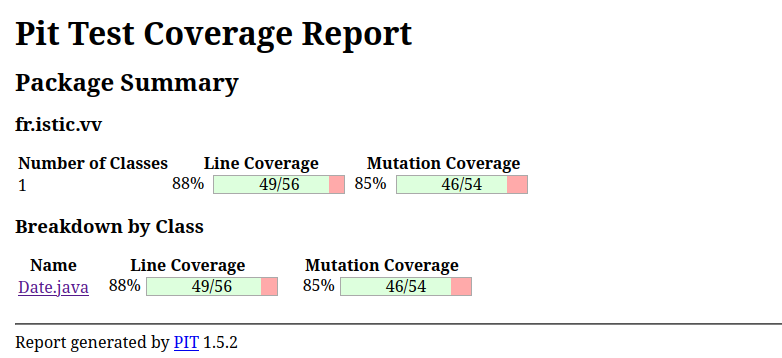

# Test the Date class

Implement a class `Date` with the interface shown below:

```java
class Date implements Comparable<Date> {

    public Date(int day, int month, int year) { ... }

    public static boolean isValidDate(int day, int month, int year) { ... }

    public static boolean isLeapYear(int year) { ... }

    public Date nextDate() { ... }

    public Date previousDate { ... }

    public int compareTo(Date other) { ... }

}
```

The constructor throws an exception if the three given integers do not form a valid date.

`isValidDate` returns `true` if the three integers form a valid year, otherwise `false`.

`isLeapYear` says if the given integer is a leap year.

`nextDate` returns a new `Date` instance representing the date of the following day.

`previousDate` returns a new `Date` instance representing the date of the previous day.

`compareTo` follows the `Comparable` convention:

* `date.compareTo(other)` returns a positive integer if `date` is posterior to `other`
* `date.compareTo(other)` returns a negative integer if `date` is anterior to `other`
* `date.compareTo(other)` returns `0` if `date` and `other` represent the same date.
* the method throws a `NullPointerException` if `other` is `null` 

Design and implement a test suite for this `Date` class.
You may use the test cases discussed in classes as a starting point. 
Also, feel free to add any extra method you may need to the `Date` class.


Use the following steps to design the test suite:

1. With the help of *Input Space Partitioning* design a set of initial test inputs for each method. Write below the characteristics and blocks you identified for each method. Specify which characteristics are common to more than one method.
2. Evaluate the statement coverage of the test cases designed in the previous step. If needed, add new test cases to increase the coverage. Describe below what you did in this step.
3. If you have in your code any predicate that uses more than two boolean operators check if the test cases written to far satisfy *Base Choice Coverage*. If needed add new test cases. Describe below how you evaluated the logic coverage and the new test cases you added.
4. Use PIT to evaluate the test suite you have so far. Describe below the mutation score and the live mutants. Add new test cases or refactor the existing ones to achieve a high mutation score.

Use the project in [tp3-date](../code/tp3-date) to complete this exercise.

## Answer
1.
### `isValidDate(int day, int month, int year)`

#### Caractéristiques identifiées :
- **Date valide ou invalide**  
  - Jour valide : 1 ≤ jour ≤ 31 (selon le mois)
  - Jour invalide : jour < 1 ou jour > 31 (ou dépassant les jours maximum du mois)
  - Mois valide : 1 ≤ mois ≤ 12
  - Mois invalide : mois < 1 ou mois > 12
  - Année valide : année ≥ 0
  - Année invalide : année < 0

- **Mois avec un nombre limité de jours**  
  - Mois de 30 jours : avril, juin, septembre, novembre
  - Mois de 31 jours : janvier, mars, mai, juillet, août, octobre, décembre
  - Février (année bissextile ou non) :
    - Février 28 jours (année non bissextile)
    - Février 29 jours (année bissextile)

#### Blocs d'entrée :
- **Jour valide** :  15
- **Jour invalide** : 32
- **Mois valide** : 1
- **Mois invalide** : 13
- **Année valide** : 2024
- **Année invalide** : -2024
- **Mois avec jours invalides** :
  - Février avec 30 jours (non valide)

#### Caractéristiques communes avec d'autres méthodes :
Les entrées de la méthode `isValidDate` sont communes avec les méthodes `nextDate()`, `previousDate()`, et `compareTo()` dans le sens où elles nécessitent des dates valides pour fonctionner.

---

### `isLeapYear(int year)`

#### Caractéristiques identifiées :
- **Année bissextile ou non**  
  - Année bissextile : divisible par 4, mais si divisible par 100, elle doit aussi être divisible par 400.
  - Année non bissextile : non divisible par 4 ou divisible par 100 mais non par 400.

#### Blocs d'entrée :
- **Année bissextile** : 2024
- **Année non bissextile** : 2023

#### Caractéristiques communes avec d'autres méthodes :
Les entrées de `isLeapYear` peuvent affecter la méthode `nextDate()` et `previousDate()` lorsque l'année change (par exemple, en février dans une année bissextile).

---

### `nextDate()`

#### Caractéristiques identifiées :
- **Changement de jour** : Transition entre les jours dans un même mois  
  - Jour suivant dans le même mois : 1 janvier → 2 janvier  

- **Changement de mois** : Fin du mois, transition au mois suivant  
  - Exemple : 31 janvier → 1 février

- **Changement d'année** : Passage du 31 décembre au 1 janvier  
  - Exemple : 31 décembre 2024 → 1 janvier 2025

- **Année bissextile ou non** : Affecte le 29 février (année bissextile)

#### Blocs d'entrée :
- **Jour au début du mois** : 1 janvier
- **Jour à la fin du mois** : 31 janvier
- **Fin de l'année** : 31 décembre → 1 janvier
- **Transition de mois sur février** :
  - 28 février 2024 → 29 février 2024 (année bissextile)
  - 28 février 2023 → 1 mars 2023 (année non bissextile)

#### Caractéristiques communes avec d'autres méthodes :
La méthode `nextDate()` dépend de la validité des dates, donc elle utilise les mêmes caractéristiques que `isValidDate`.
Les transitions de mois et d'année dans `nextDate()` sont aussi affectées par le résultat de `isLeapYear`.

---

### `previousDate()`

#### Caractéristiques identifiées :
- **Changement de jour** : Retour au jour précédent dans un même mois  
  - Exemple : 2 janvier → 1 janvier

- **Changement de mois** : Retour au dernier jour du mois précédent  
  - Exemple : 1 février → 31 janvier

- **Changement d'année** : Retour au 31 décembre de l'année précédente  
  - Exemple : 1 janvier 2024 → 31 décembre 2023

- **Année bissextile ou non** : Retour sur le 29 février si l'année précédente était bissextile sur le 28 sinon.

#### Blocs d'entrée :
- **Jour du mois** : 2 janvier -> 1 janvier
- **Transition de mois** : 1 février -> 31 janvier
- **Transition de mois de février dans une année bissextile** : 1 mars → 29 février
- **Transition de mois de février dans une année non bissextile** : 1 mars → 28 février
- **Retour à l'année précédente** : 1 janvier 2024 → 31 décembre 2023

#### Caractéristiques communes avec d'autres méthodes :
Semblable à `nextDate()`, mais dans la direction opposée. Utilise les mêmes partitions de mois et d'année, y compris les années bissextiles.

---

### `compareTo(Date other)`

#### Caractéristiques identifiées :
- **Comparaison de dates égales** : Deux dates identiques doivent retourner `0`  
  - Exemple : 1 janvier 2024 → 1 janvier 2024

- **Comparaison d'une date antérieure** : Une date plus ancienne doit être inférieure à une date plus récente et retourner un entier (int) négatif.
  - Exemple : 1 janvier 2024 → 2 janvier 2024

- **Comparaison d'une date postérieure** : Une date plus récente doit être supérieure à une date plus ancienne et retourner un entier (int) positif.  
  - Exemple : 2 janvier 2024 → 1 janvier 2024

- **Comparaison avec `null`** : Une exception `NullPointerException` doit être levée si la date à comparer est `null`.

#### Blocs d'entrée :
- **Dates égales** : 1 janvier 2024 → 1 janvier 2024
- **Date antérieure** : 1 janvier 2024 → 2 janvier 2024
- **Date postérieure** : 2 janvier 2024 → 1 janvier 2024
- **Comparaison avec `null`** : Comparer une date à `null`

#### Caractéristiques communes avec d'autres méthodes :
Les méthodes `nextDate()`, `previousDate()` et `isValidDate()` utilisent toutes la notion de validité des dates, qui est utilisée pour déterminer si une comparaison est correcte.

---

2. Les cas listés plus hauts couvre la majorité des cas possibles et quand nous lançons les tests nous avons un coverage de 92% des lignes.

3. Nous ne sommes pas de ce cas.

4. Quand nous utilisons PIT notre taux de converture est: 


