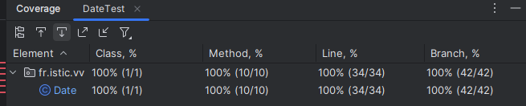
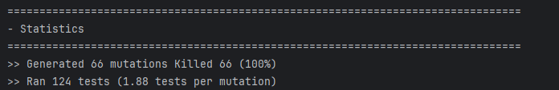

# Test the Date class

Implement a class `Date` with the interface shown below:

```java
class Date implements Comparable<Date> {

    public Date(int day, int month, int year) { ... }

    public static boolean isValidDate(int day, int month, int year) { ... }

    public static boolean isLeapYear(int year) { ... }

    public Date nextDate() { ... }

    public Date previousDate { ... }

    public int compareTo(Date other) { ... }

}
```

The constructor throws an exception if the three given integers do not form a valid date.

`isValidDate` returns `true` if the three integers form a valid year, otherwise `false`.

`isLeapYear` says if the given integer is a leap year.

`nextDate` returns a new `Date` instance representing the date of the following day.

`previousDate` returns a new `Date` instance representing the date of the previous day.

`compareTo` follows the `Comparable` convention:

* `date.compareTo(other)` returns a positive integer if `date` is posterior to `other`
* `date.compareTo(other)` returns a negative integer if `date` is anterior to `other`
* `date.compareTo(other)` returns `0` if `date` and `other` represent the same date.
* the method throws a `NullPointerException` if `other` is `null` 

Design and implement a test suite for this `Date` class.
You may use the test cases discussed in classes as a starting point. 
Also, feel free to add any extra method you may need to the `Date` class.


Use the following steps to design the test suite:

1. With the help of *Input Space Partitioning* design a set of initial test inputs for each method. Write below the characteristics and blocks you identified for each method. Specify which characteristics are common to more than one method.
2. Evaluate the statement coverage of the test cases designed in the previous step. If needed, add new test cases to increase the coverage. Describe below what you did in this step.
3. If you have in your code any predicate that uses more than two boolean operators check if the test cases written to far satisfy *Base Choice Coverage*. If needed add new test cases. Describe below how you evaluated the logic coverage and the new test cases you added.
4. Use PIT to evaluate the test suite you have so far. Describe below the mutation score and the live mutants. Add new test cases or refactor the existing ones to achieve a high mutation score.

Use the project in [tp3-date](../code/tp3-date) to complete this exercise.

## Answer

1. With the help of *Input Space Partitioning* design a set of initial test inputs for each method. Write below the characteristics and blocks you identified for each method. Specify which characteristics are common to more than one method.


## **1. Method: `Date(int day, int month, int year)`**

### **Characteristics and Partitions**
| **Characteristic**       | **Blocks** | **Description**|
|------------------------|------------|----------------|
| **Day**                 | Day < 1 (Invalid)   1 ≤ Day ≤ 28 (Valid)   Day = 29 (Valid for leap year)   Day = 30 (Valid for months with 30 days)   Day = 31 (Valid for months with 31 days)   Day > 31 (Invalid) | Different ranges to verify day limits. |
| **Month**               | Month < 1 (Invalid)   1 ≤ Month ≤ 12 (Valid)   Month > 12 (Invalid) | Tests month validity. |
| **Year**                | Negative year (Valid?)   Year = 0 (Valid?)   Year > 0 (Valid) | Determine if negative and zero years are supported. |
| **Special Cases**       | End of month (31st for 31-day months)   End of month (30th for 30-day months)   End of month (28th or 29th for February) | Boundary testing for month-end logic. |

## **2. Method: `isValidDate(int day, int month, int year)`**

### **Characteristics and Partitions**
| **Characteristic** | **Blocks**| **Description** |
|-------------|------------------------------|-----------------|
| **Day**     | Same as the `Date` constructor | The same set of test cases as the constructor applies here. |
| **Month**   | Same as the `Date` constructor | Test cases for months are also the same.     |
| **Year**    | Same as the `Date` constructor | Tests for negative, zero, and positive years.|
| **Leap Year**| Leap Year (Yes/No)| Handle leap year correctly for February 29.  |

## **3. Method: `isLeapYear(int year)`**

### **Characteristics and Partitions**
| **Characteristic**       | **Blocks** | **Description**|
|------------------------|------------|----------------|
| **Year**                | Year % 400 = 0 (Leap Year)   Year % 100 = 0 but Year % 400 ≠ 0 (Not a Leap Year)   Year % 4 = 0 but Year % 100 ≠ 0 (Leap Year)   Year % 4 ≠ 0 (Not a Leap Year) | Covers rules for leap year calculation. |
| **Boundary Tests**       | Year = 0   Negative years | Check boundary conditions for the year. |

## **4. Method: `nextDate()`**

### **Characteristics and Partitions**
| **Characteristic** | **Blocks**  | **Description** |
|--------------------|-------------|-----------------|
| **Day**            | Last day of month (day = 28, 29, 30, 31)   Normal day (1 ≤ day ≤ 27) | Handles end-of-month and normal cases. |
| **Month**          | End of year (month = 12)   Normal month (1 ≤ month ≤ 11) | Handle year rollover for December. |
| **Year**           | Current year changes (Dec 31, 2024 → Jan 1, 2025)   No change in year | Verifies year transition. |
| **Special Cases**  | Last day of February in a leap year   Last day of February in a non-leap year | Handle the 28/29 day transition. |

## **5. Method: `previousDate()`**

### **Characteristics and Partitions**
| **Characteristic**       | **Blocks** | **Description**|
|------------------------|------------|----------------|
| **Day**                 | First day of month (day = 1)   Normal day (2 ≤ day ≤ 31) | Handle month change for day 1. |
| **Month**               | First month of the year (month = 1)   Normal month (2 ≤ month ≤ 12) | Handle year rollback. |
| **Year**                | Year changes (Jan 1, 2024 → Dec 31, 2023)   No change in year | Verifies year transition. |
| **Special Cases**       | First day of March in a leap year (March 1)   First day of March in a non-leap year | Handle the February to March transition. |

## **6. Method: `compareTo(Date other)`**

### **Characteristics and Partitions**
| **Characteristic**       | **Blocks**     | **Description** |
|------------------------|----------------|-----------------|
| **Date Difference**     | Same Date (this == other)   This date is earlier (this < other)   This date is later (this > other) | Verify the comparison logic. |
| **Year Difference**     | Same year, earlier/later month   Different year | Compare years correctly. |
| **Month Difference**    | Same month, earlier/later day | Compare months correctly. |
| **Day Difference**      | Same day, earlier/later time | Compare days correctly. |


## **Summary of Test Inputs**

| **Method**         | **Characteristic** | **Test Inputs (Examples)** |
|-------------------|------------------|---------------------------|
| **Date()**         | Day                | `Date(0, 1, 2024)` (Invalid)   `Date(31, 4, 2024)` (Invalid)   `Date(29, 2, 2024)` (Leap Year)   `Date(28, 2, 2023)` (Non-Leap Year) |
| **isValidDate()**  | Leap Year         | `isValidDate(29, 2, 2000)` (Leap Year)   `isValidDate(29, 2, 2100)` (Not Leap Year) |
| **isLeapYear()**   | Leap Year Rules   | `isLeapYear(2000)` (True)   `isLeapYear(1900)` (False)   `isLeapYear(2024)` (True) |
| **nextDate()**     | Year Transition   | `Date(31, 12, 2023).nextDate()` (Jan 1, 2024) |
| **previousDate()** | Year Transition   | `Date(1, 1, 2024).previousDate()` (Dec 31, 2023) |
| **compareTo()**    | Date Comparison   | `Date(1, 1, 2024).compareTo(new Date(1, 1, 2024))` (0)   `Date(2, 1, 2024).compareTo(new Date(1, 1, 2024))` (1) |


## **Summary of Common Characteristics**

| **Characteristic** | **Methods Sharing Characteristic** |
|-------------------|-------------------------------------|
| **Day**           | Date(), isValidDate(), nextDate(), previousDate() |
| **Month**         | Date(), isValidDate(), nextDate(), previousDate() |
| **Year**          | Date(), isValidDate(), nextDate(), previousDate(), isLeapYear() |
| **Leap Year**     | isValidDate(), isLeapYear()          |


2. Evaluate the statement coverage of the test cases designed in the previous step. If needed, add new test cases to increase the coverage. Describe below what you did in this step.


We tried to have the highest code coverage and branch coverage by have a test to cover everything. Even though we know that it doesn't guarantee that the code is bug free.
The test suite was made to pass the limit cases and every branches.

4. Use PIT to evaluate the test suite you have so far. Describe below the mutation score and the live mutants. Add new test cases or refactor the existing ones to achieve a high mutation score.

- Below is a screenshot of the results of the PIT analysis. It can be seen that 66 mutants were generated, all of which were successfully killed, showing that the existing test set is sufficiently robust. However, this does not prove that the code is bugfree.




