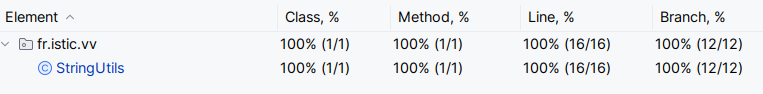
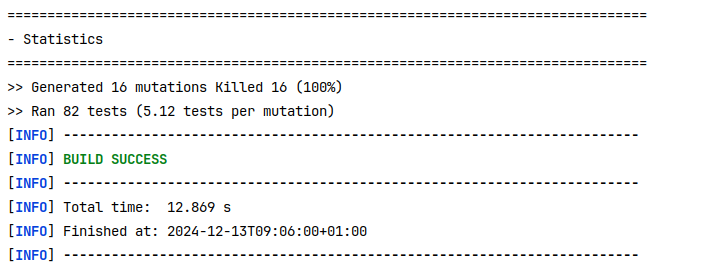

# Test the Date class

Implement a class `Date` with the interface shown below:

```java
class Date implements Comparable<Date> {

    public Date(int day, int month, int year) { ... }

    public static boolean isValidDate(int day, int month, int year) { ... }

    public static boolean isLeapYear(int year) { ... }

    public Date nextDate() { ... }

    public Date previousDate { ... }

    public int compareTo(Date other) { ... }

}
```

The constructor throws an exception if the three given integers do not form a valid date.

`isValidDate` returns `true` if the three integers form a valid year, otherwise `false`.

`isLeapYear` says if the given integer is a leap year.

`nextDate` returns a new `Date` instance representing the date of the following day.

`previousDate` returns a new `Date` instance representing the date of the previous day.

`compareTo` follows the `Comparable` convention:

* `date.compareTo(other)` returns a positive integer if `date` is posterior to `other`
* `date.compareTo(other)` returns a negative integer if `date` is anterior to `other`
* `date.compareTo(other)` returns `0` if `date` and `other` represent the same date.
* the method throws a `NullPointerException` if `other` is `null` 

Design and implement a test suite for this `Date` class.
You may use the test cases discussed in classes as a starting point. 
Also, feel free to add any extra method you may need to the `Date` class.


Use the following steps to design the test suite:

1. With the help of *Input Space Partitioning* design a set of initial test inputs for each method. Write below the characteristics and blocks you identified for each method. Specify which characteristics are common to more than one method.
2. Evaluate the statement coverage of the test cases designed in the previous step. If needed, add new test cases to increase the coverage. Describe below what you did in this step.
3. If you have in your code any predicate that uses more than two boolean operators check if the test cases written to far satisfy *Base Choice Coverage*. If needed add new test cases. Describe below how you evaluated the logic coverage and the new test cases you added.
4. Use PIT to evaluate the test suite you have so far. Describe below the mutation score and the live mutants. Add new test cases or refactor the existing ones to achieve a high mutation score.

Use the project in [tp3-date](../code/tp3-date) to complete this exercise.

## Answer

1. Classe Date
    * isValidDate :
      * Date(31,12,2024) : dernier jour de l'année => true
      * Date(1,12,2024) : premier jour de l'année => true
      * Date(15,06,2024) : jour de l'année => true
      * Date(29,2,2024) : 29 février bisextile => true
      * Date(31,11,2024) : jour trop grand => false
      * Date(0,11,2024) : jour trop petit => false
      * Date(15,13,2024) : mois trop grand => false
      * Date(15,0,2024) : mois trop petit => false
    * isLeapYear :
      * isLeapYear(2024) : années bisextile => true
      * isLeapYear(2023) : année non bisextile => false
      * isLeapYear(1900) : année non bisextile exception => false
      * isLeapYear(2000) : année bisextile => true
    * nextDate() :
      * Date(12,1,2024) : date classique => Date(13,1,2024)
      * Date(31,1,2024) : date changement de mois => Date(1,2,2024)
      * Date(31,12,2024) : date changement de mois et d'année => Date(1,1,2025)
    * previousDate() :
      * Date(31,6,2024) : date classique => Date(30,6,2024)
      * Date(1,2,2024) : date changement de mois => Date(31,1,2024)
      * Date(1,1,2025) : date changement de mois et d'année => Date(31,12,2024)
    * compareTo() :
      * Date(1, 1, 2025).compareTo(Date(1, 1, 2024)) => positive
      * Date(1, 1, 2024).compareTo(Date(1, 1, 2024)) => 0
      * Date(1, 1, 2023).compareTo(Date(1, 1, 2024)) => negative
      * Date(1,1,2023).comapreTo(null) => throw(exception)

2. Avec des print, nous avons vérifier que tout les blocks de nos fonctions sont bien parcouru par nos test. Nous n'atteignons juste pas le return 0 de getDaysInMonth() car une vérification est faites avant d'appeler cette méthodes. Il est donc impossible d'y rentrer avec un numéro de mois invalide.

3. Nous n'avons pas utilisé de prédicat avec plus de opérateurs booléen.

4. Résultats du coverage par mutation :

```bash
- Statistics
================================================================================
>> Generated 68 mutations Killed 54 (79%)
>> Ran 112 tests (1.65 tests per mutation)
```

On peut voir des résulats plutôt positifs mais intéressons nous aux mutants qui n'ont pas étés tués.

On a par exemple ce mutant qui n'a pas été tué :




Cette règle signifie que les tests n'ont pas échoués lorsque le symbole `<` a été modifié en `<=`. Pour remédier à ce problème, ont peut ajouter un cas de test pour l'année 0.

Ensuite, à la ligne d'après on a un remplacement du boolean false en true et ca ne fais pas echouer les test. Cela est du au fait que nous n'avons pas fais de test pour des années inférieures à 1. On a donc rajotuer un test pour l'an 0.

De même, pour cette partie du code, un mutant `changed conditional boundary` a survecu (mais seulement le 1 car nous avons fais des tests avec le 12eme mois): 


Nous l'avons tué en faisant un test avec le mois 1.

Il nous reste encore des problèmes de coverage dans le fonctions non testé (les getter et le getDayInMonth()) mais ont obtient un pourcentage de mutants tués de  82%