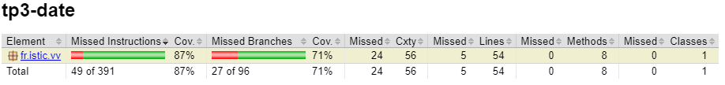
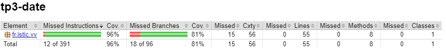
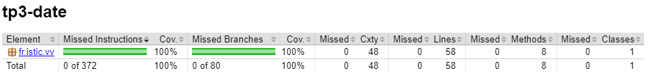
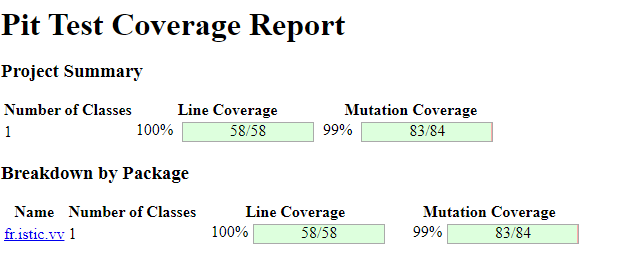
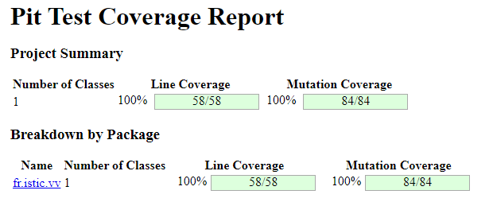

# Test the Date class

Implement a class `Date` with the interface shown below:

```java
class Date implements Comparable<Date> {

    public Date(int day, int month, int year) { ... }

    public static boolean isValidDate(int day, int month, int year) { ... }

    public static boolean isLeapYear(int year) { ... }

    public Date nextDate() { ... }

    public Date previousDate { ... }

    public int compareTo(Date other) { ... }

}
```

The constructor throws an exception if the three given integers do not form a valid date.

`isValidDate` returns `true` if the three integers form a valid year, otherwise `false`.

`isLeapYear` says if the given integer is a leap year.

`nextDate` returns a new `Date` instance representing the date of the following day.

`previousDate` returns a new `Date` instance representing the date of the previous day.

`compareTo` follows the `Comparable` convention:

* `date.compareTo(other)` returns a positive integer if `date` is posterior to `other`
* `date.compareTo(other)` returns a negative integer if `date` is anterior to `other`
* `date.compareTo(other)` returns `0` if `date` and `other` represent the same date.
* the method throws a `NullPointerException` if `other` is `null` 

Design and implement a test suite for this `Date` class.
You may use the test cases discussed in classes as a starting point. 
Also, feel free to add any extra method you may need to the `Date` class.


Use the following steps to design the test suite:

1. With the help of *Input Space Partitioning* design a set of initial test inputs for each method. Write below the characteristics and blocks you identified for each method. Specify which characteristics are common to more than one method.
2. Evaluate the statement coverage of the test cases designed in the previous step. If needed, add new test cases to increase the coverage. Describe below what you did in this step.
3. If you have in your code any predicate that uses more than two boolean operators check if the test cases written to far satisfy *Base Choice Coverage*. If needed add new test cases. Describe below how you evaluated the logic coverage and the new test cases you added.
4. Use PIT to evaluate the test suite you have so far. Describe below the mutation score and the live mutants. Add new test cases or refactor the existing ones to achieve a high mutation score.

Use the project in [tp3-date](../code/tp3-date) to complete this exercise.

## Answer

1. Input Space Partitioning

    1. Constructor **Date()** & **isValidDate()** : the constructor is calling isValidDate() to check if the date is valid. The inputs to test will be the same for both methods. We need to test if we can instantiate/validate correct dates (such as 31/12/2024), and block dates that cannot exist. Invalid dates are date for which the day number is wrong for the current month and year, or the month number is invalid (greater than 12 or less than 1).
        - 0, 0, 0: invalid
        - 1, 1, 1: valid
        - 31, 12, 2024: valid
        - 29, 2, 2024: valid
        - 29, 2, 2023: invalid
        - 31, 4, 2024: invalid
        - 1, 13, 2024: invalid

    2. **isLeapYear()**
        - 2024: leap year
        - 2023: not leap year
        - 2000 : leap year
        - 1900 : not leap year

    3. **daysInMonth()**
        - 1, 2024: 31
        - 2, 2024: 29
        - 2, 2023: 28
        - 4, 2024: 30
        - 13, 2024: 0

    4. **nextDate()**
        - 1, 1, 2024: 2, 1, 2024
        - 31, 12, 2024: 1, 1, 2025
        - 29, 2, 2024: 1, 3, 2024
        - 28, 2, 2023: 1, 3, 2023
        - 30, 4, 2024: 1, 5, 2024

    5. **previousDate()**
        - 1, 1, 2024: 31, 12, 2023
        - 1, 3, 2024: 29, 2, 2024
        - 1, 3, 2023: 28, 2, 2023
        - 1, 5, 2024: 30, 4, 2024
        - 2, 1, 2024: 1, 1, 2024

    6. **compareTo()**
        - 1, 1, 2024 & 1, 1, 2024: 0
        - 1, 1, 2024 & 2, 1, 2024: -1
        - 1, 1, 2024 & 31, 12, 2023: 1
        - 1, 1, 2024 & 1, 1, 2023: 1
        - 1, 1, 2024 & 1, 1, 2025: -1

2. After adding the test cases described above, we have a coverage of 87% and 24 lines were missed.



Using `Coverage Gutters` I identified the line not covered and added the relevant test cases.

```diff
    @Test
    void testNextDate() {
        ...
+       date = new Date(31, 10, 2024);
+       assertEquals(new Date(1, 11, 2024).toString(), date.nextDate().toString());
    }

    @Test
    void testPreviousDate() {
        ...
+       date = new Date(1, 11, 2024);
+       assertEquals(new Date(31, 10, 2024).toString(), date.previousDate().toString());
    }

    @Test
    void testCompareTo() {
        ...
+       date1 = new Date(1, 1, 2024);
+       date2 = new Date(1, 2, 2024);
+       assertEquals(-1, date1.compareTo(date2));
+
+       assertThrows(NullPointerException.class, () -> {
+           Date date = new Date(1, 1, 2024);
+           date.compareTo(null);
+       });
    }

+   @Test
+   void testCannotInstantiateInvalidDate() {
+       assertThrows(IllegalArgumentException.class, () -> new Date(0, 0, 0));
+       assertThrows(IllegalArgumentException.class, () -> new Date(29, 2, 2023));
+       assertThrows(IllegalArgumentException.class, () -> new Date(31, 4, 2024));
+       assertThrows(IllegalArgumentException.class, () -> new Date(1, 13, 2024));
+   }
```

After adding those new test cases, the coverage went up to 96%. Apparently one line is still missed but JaCoCo can't tell which one.



3. Currently the Base Choice Coverage is only at 81%. 15 branches are still not tested. I added the following test cases to improve that :

```diff
    @Test
    void testDaysInMonth() {
        ...
+       assertEquals(0, Date.daysInMonth(0, 2024));
        ...
    }

    @Test
    void testNextDate() {
        // Cas de test: date, expectedNextDate
        Object[][] testCases = {
            {new Date(1, 1, 2024), new Date(2, 1, 2024)},
            {new Date(31, 12, 2024), new Date(1, 1, 2025)},
            {new Date(29, 2, 2024), new Date(1, 3, 2024)},
+           {new Date(28, 2, 2024), new Date(29, 2, 2024)},
            {new Date(28, 2, 2023), new Date(1, 3, 2023)},
+           {new Date(30, 12, 2024), new Date(31, 12, 2024)},
            {new Date(30, 4, 2024), new Date(1, 5, 2024)},
+           {new Date(30, 6, 2024), new Date(1, 7, 2024)},
+           {new Date(30, 9, 2024), new Date(1, 10, 2024)},
+           {new Date(30, 11, 2024), new Date(1, 12, 2024)},
+           {new Date(15, 4, 2024), new Date(16, 4, 2024)},
+           {new Date(15, 6, 2024), new Date(16, 6, 2024)},
+           {new Date(15, 9, 2024), new Date(16, 9, 2024)},
+           {new Date(15, 11, 2024), new Date(16, 11, 2024)},
            {new Date(31, 10, 2024), new Date(1, 11, 2024)},
+           {new Date(1, 2, 2024), new Date(2, 2, 2024)},
        };

        for (Object[] testCase : testCases) {
            Date date = (Date) testCase[0];
            Date expectedNextDate = (Date) testCase[1];
            assertEquals(expectedNextDate.toString(), date.nextDate().toString());
        }
    }

    @Test
    void testPreviousDate() {
        // Cas de test: date, expectedPreviousDate
        Object[][] testCases = {
            {new Date(1, 1, 2024), new Date(31, 12, 2023)},
            {new Date(1, 3, 2024), new Date(29, 2, 2024)},
            {new Date(1, 3, 2023), new Date(28, 2, 2023)},
            {new Date(1, 5, 2024), new Date(30, 4, 2024)},
+           {new Date(1, 7, 2024), new Date(30, 6, 2024)},
+           {new Date(1, 10, 2024), new Date(30, 9, 2024)},
+           {new Date(1, 12, 2024), new Date(30, 11, 2024)},
            {new Date(2, 1, 2024), new Date(1, 1, 2024)},
            {new Date(1, 11, 2024), new Date(31, 10, 2024)},
        };

        for (Object[] testCase : testCases) {
            Date date = (Date) testCase[0];
            Date expectedPreviousDate = (Date) testCase[1];
            assertEquals(expectedPreviousDate.toString(), date.previousDate().toString());
        }
    }
```

I also refactored some code in the class : 

```diff
    public static int daysInMonth(int month, int year) {
        int nbOfDays;
        
        if (month < 1 || month > 12) {
            nbOfDays = 0;
        } else if (month == 4 || month == 6 || month == 9 || month == 11) {
            nbOfDays = 30;
-        } else if (month == 2 && isLeapYear(year)) {
+        } else if (month == 2) {
-           nbOfDays = 29;
+           if (isLeapYear(year)) {
+               nbOfDays = 29;
+           } else {
+               nbOfDays = 28;
+           }
-       } else if (month == 2 && !isLeapYear(year)) {
-           nbOfDays = 28;
        } else {
            nbOfDays = 31;
        }

        return nbOfDays;
    }

    public Date nextDate() {
        if (day == 31 && month == 12) {
            return new Date(1, 1, year + 1);
        } else if (day == 30 && (month == 4 || month == 6 || month == 9 || month == 11)) {
            return new Date(1, month + 1, year);
-       } else if (day == 29 && month == 2) {
-           return new Date(1, 3, year);
-       } else if (day == 28 && month == 2 && !isLeapYear(year)) {
-           return new Date(1, 3, year);
+       } else if (month == 2) {
+           if (day == 28 && isLeapYear(year)) {
+               return new Date(29, 2, year);
+           } else if (day == 29 || day == 28) {
+               return new Date(1, 3, year);
+           } else {
+               return new Date(day + 1, 2, year);
+           }
        } else if (day == 31) {
            return new Date(1, month + 1, year);
        } else {
            return new Date(day + 1, month, year);
        }
    }

    public Date previousDate() {
-       ancien code
+       if (day > 1) {
+           return new Date(day - 1, month, year);
+       } else if (month == 1) {
+           return new Date(31, 12, year - 1);
+       } else if (month == 5 || month == 7 || month == 10 || month == 12) {
+           return new Date(30, month - 1, year);
+       } else if (month == 3) {
+           if (isLeapYear(year)) {
+               return new Date(29, 2, year);
+           } else {
+               return new Date(28, 2, year);
+           }
+       } else {
+           return new Date(31, month - 1, year);
+       }
    }
```

Thanks to those changes, the coverage went up to 100% for both statement coverage and branch coverage.



4. Running PIT gave the following results :



The single line not covered is the toString() method. Changing its output to "" didn't result in a failed test case. The solution was to add a test method :

```java
    @Test
    void testToString() {
        Date date = new Date(1, 1, 2024);
        assertEquals("01/01/2024", date.toString());
    }
```

