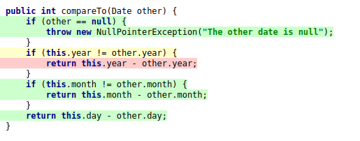

# Test the Date class

Implement a class `Date` with the interface shown below:

```java
class Date implements Comparable<Date> {

    public Date(int day, int month, int year) { ... }

    public static boolean isValidDate(int day, int month, int year) { ... }

    public static boolean isLeapYear(int year) { ... }

    public Date nextDate() { ... }

    public Date previousDate { ... }

    public int compareTo(Date other) { ... }

}
```

The constructor throws an exception if the three given integers do not form a valid date.

`isValidDate` returns `true` if the three integers form a valid year, otherwise `false`.

`isLeapYear` says if the given integer is a leap year.

`nextDate` returns a new `Date` instance representing the date of the following day.

`previousDate` returns a new `Date` instance representing the date of the previous day.

`compareTo` follows the `Comparable` convention:

* `date.compareTo(other)` returns a positive integer if `date` is posterior to `other`
* `date.compareTo(other)` returns a negative integer if `date` is anterior to `other`
* `date.compareTo(other)` returns `0` if `date` and `other` represent the same date.
* the method throws a `NullPointerException` if `other` is `null` 

Design and implement a test suite for this `Date` class.
You may use the test cases discussed in classes as a starting point. 
Also, feel free to add any extra method you may need to the `Date` class.


Use the following steps to design the test suite:

1. With the help of *Input Space Partitioning* design a set of initial test inputs for each method. Write below the characteristics and blocks you identified for each method. Specify which characteristics are common to more than one method.
2. Evaluate the statement coverage of the test cases designed in the previous step. If needed, add new test cases to increase the coverage. Describe below what you did in this step.
3. If you have in your code any predicate that uses more than two boolean operators check if the test cases written to far satisfy *Base Choice Coverage*. If needed add new test cases. Describe below how you evaluated the logic coverage and the new test cases you added.
4. Use PIT to evaluate the test suite you have so far. Describe below the mutation score and the live mutants. Add new test cases or refactor the existing ones to achieve a high mutation score.

Use the project in [tp3-date](../code/tp3-date) to complete this exercise.

## Answer

____
1. Les cas à traiter sont les suivants
* `public Date(int day, int month, int year) { ... }`
    - L'année est invalide : `year < 0`
    - Le mois est invalide: `month < 1 || month > 12`
    - Le jour est invalide: `day < 1 || day > jourMaxMois`

* `public static boolean isValidDate(int day, int month, int year) { ... }`
    **idem constructeur**

* `public static boolean isLeapYear(int year) { ... }`
    - L'année est une année bisextile : `&& (year % 100 != 0 || year % 400 == 0)`
    - L'année n'est pas bisextile

* `public Date nextDate() { ... }`
    - La date n'est pas le premier ou le dernier jour du mois ou de l'année (cas nominal) 
    - La date est le premier jour du mois 
    - La date est le premier jour du mois et de l'année  
    - La date est le dernier jour du mois 
    - La date est le dernier jour du mois et de l'année

* `public Date previousDate { ... }`
    **idem nexDate()**

* `public int compareTo(Date other) { ... }`
    - Les dates ont le même jour, le même mois et la même année : return `true`
    - Les dates ont un de ces attribut de différent : return `false`
____
2. Le coverage dans un premier temps :

Les 2 lignes qui ne sont pas couvertes sont :



J'ajoute les cas de tests suivants :
```java
@Test
void testIsValidDateInvalidMonth() {
    assertFalse(Date.isValidDate(15, 13, 2021)); // Invalid month
}

@Test
void testIsValidDateInvalidNegativeDay() {
    assertFalse(Date.isValidDate(0, 1, 2021)); // Invalid negative day
}

@Test
void testIsValidDateInvalidNegativeMonth() {
    assertFalse(Date.isValidDate(1, 0, 2021)); // Invalid negative month
}

@Test
void testIsValidDateInvalidNegativeYear() {
    assertFalse(Date.isValidDate(1, 1, 0)); // Invalid negative year
}
@Test
void testCompareToAnterior() {
    Date date1 = new Date(1, 1, 2021);
    Date date2 = new Date(31, 12, 2021);
    assertTrue(date1.compareTo(date2) < 0); // date1 is anterior to date2
}

@Test
void testCompareToPosterior() {
    Date date1 = new Date(1, 1, 2021);
    Date date2 = new Date(31, 12, 2021);
    assertTrue(date2.compareTo(date1) > 0); // date2 is posterior to date1
}
```

Le nouveau line coverage est à 100% :

____
3. `Best case coverage` sur expression 
```java
year % 4 == 0 && (year % 100 != 0 || year % 400 == 0)
```

On a ainsi 3 cas à tester :

| Condition | year % 4 == 0 | year % 100 != 0 | year % 400 == 0 | Résultat |
|-----------|---------------|-----------------|-----------------|-----------------|
| Case 1    | true          | true            | true            | true            |
| Case 2    | false         | true            | true            | false           |
| Case 3    | true          | true            | false           | true            |
| Case 4    | true          | false           | false           | false           |
| Case 5    | true          | false           | true            | true            |
| Case 6 (idem 4)| true          | false           | false           | false           |

Les tests associés sont :

```java
@Test
void isLeapYearCase1() {
    assertTrue(Date.isLeapYear(2024));
}

@Test
void isLeapYearCase2() {
    assertFalse(Date.isLeapYear(2001));
}

@Test
void isLeapYearCase3() {
    assertTrue(Date.isLeapYear(2004));
}

@Test
void isLeapYearCase4() {
    assertFalse(Date.isLeapYear(2100));
}

@Test
void isLeapYearCase5() {
    assertTrue(Date.isLeapYear(2400));
}
```
____

4. Exécution de PIT:
